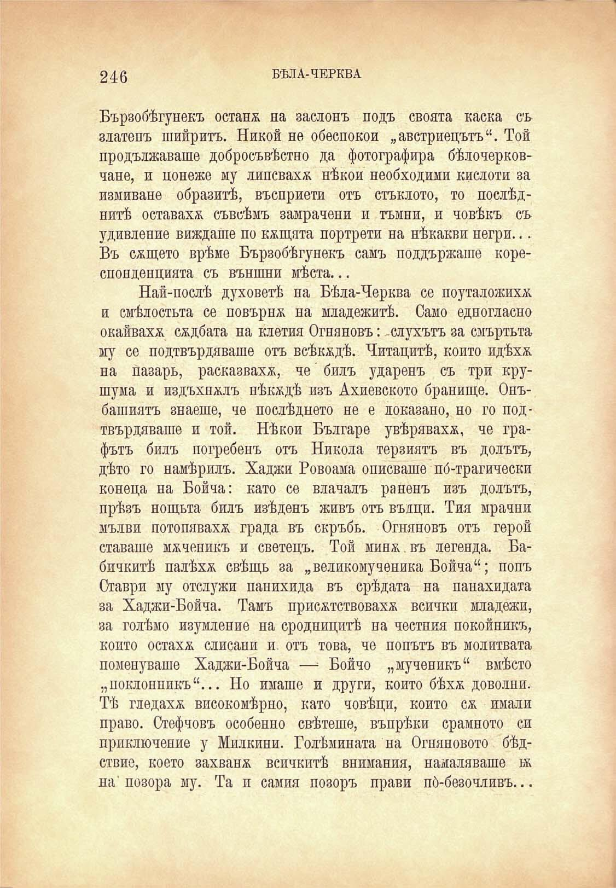

246

БѢЛА-ЧЕРКВА

Бързобѣгунекъ останя на заслонъ подъ своята каска съ златенъ шийритъ. Никой не обеспокои „австриецътъ“. Той продължаваше добросъвѣстно да фотографира бѣлочерковчане, и понеже му липсваха нѣкои необходими кислоти за измиване образитѣ, въсприети отъ стъклото, то послѣднитѣ оставаха съвсѣмъ замрачени и тъмни, и човѣкъ съ удивление виждаше по кѫщата портрети на нѣкакви негри... Въ сящето врѣме Бързобѣгунекъ самъ поддържаше кореспонденцията съ външни мѣста...

Най-послѣ духоветѣ на Бѣла-Черква се поуталожиха и смѣлостьта се повърня на младежитѣ. Само едногласно окайвахя сядбата на клетия Огняновъ: -слухътъ за смъртьта му се подтвърдяваше отъ всѣкядѣ. Читацитѣ, който идѣхя на пазаръ, расказвахя, че билъ ударенъ съ три крушума и издъхналъ нѣкядѣ изъ Ахиевското бранище. Онъбашиятъ знаеше, че послѣднето не е локазано, но го подтвърдяваше и той. Нѣкои Българе увѣряваха, че графътъ билъ погребенъ отъ Никола терзиятъ въ долътъ, дѣто го намѣрилъ. Хаджи Ровоама описваше по́-трагически конеца на Бойча: като се влачалъ раненъ изъ долътъ, прѣзъ нощьта билъ изѣденъ живъ отъ вълци. Тия мрачни мълви потопяваха града въ скръбь. Огняновъ отъ герой ставаше мѫченикъ и светецъ. Той миня.въ легенда. Бабичкитѣ палѣхя свѣщь за „великомучепика Бойча“; попъ Ставри му отслужи панихида въ срѣдата на панахидата за Хаджи-Бойча. Тамъ присятствовахя всички младежи, за голѣмо изумление на сродницитѣ на честния покойникъ, който остахя слисани и. отъ това, че попътъ въ молитвата поменуваше Хаджи-Бойча —■ Бойчо „мученикъ“ вмѣсто „поклонникъ“... Но имаше и други, който бѣхя доволни. Тѣ гледахя високомѣрно, като човѣци, който ся имали право. Стефчовъ особенно свѣтеше, въпрѣки срамното си приключение у Милкини. Голѣмината на Огняновото бѣдствие, което захваня всичкитѣ внимания, намаляваше 1я на'позора му. Та и самия позоръ прави по́-безочливъ...

