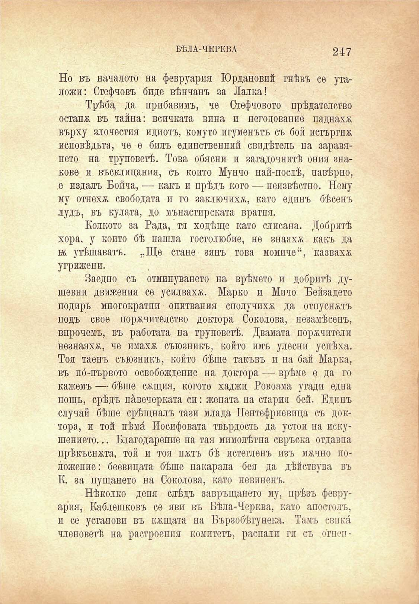

БѢЛА-ЧЕРКВА

247

Но въ началото на февруария Юрдановий гнѣвъ се уталожи: Стефчовъ биде вѣнчанъ за Лалка!

Трѣба, да прибавимъ, че Стефчовото прѣдателство остана въ тайна: всичката вина и негодование паднаха върху злочестия идиотъ, комуто игуменътъ съ бой истъргнж исповѣдьта, че е билъ единственний свидѣтель на заравянето на труповетѣ. Това обясни и загадочнитѣ ония знакове и въсклицания, съ който Мунчо най-послѣ, навѣрно, е издалъ Бойча, — какъ и прѣдъ кого — неизвѣстно. Нему му отнеха свободата и го заключиха, като единъ бѣсенъ лудъ, въ кулата, до мънастпрската вратня.

Колкото за Рада, тя ходѣще като слисана. Добритѣ хора, у който бѣ нашла гостолюбие, не зпаяхж какъ да въ утѣшаватъ. „Ще стане зянъ това момиче“, казваха угрижени.

Заедно съ отминуването на врѣмето и добритѣ душевни движения се усилваха. Марко и Мичо 'Бейзадето подиръ многократни опитвания сполучихѫ да отпуснатъ подъ свое порачителство доктора Соколова, незамѣсенъ, впрочемъ, въ работата на труповетѣ. Двамата порачптели незнаяха, че имаха съюзникъ, който имъ улесни успѣха. Тоя таенъ съюзникъ, който бѣше такъвъ и на бай Марка, въ по́-първото освобождение на доктора — врѣме е да го кажемъ — бѣше сащия, когото хаджи Ровоама угади една нощь, срѣдъ пѝвечерката си: жената на стария бей. Едипъ случай бѣше срѣщналъ тази млада Пентефриевица съ доктора, и той нѣма Иосифовата твърдость да устои па искушението... Благодарение на тая мимолѣтна свръска отдавна прѣкъснжта, той и тоя пжтъ бѣ нетегленъ изъ мжчно положение: беевицата бѣше накарала бея да дѣйствува въ К. за пущането на Соколова, като невиненъ.

Нѣколко деня слѣдъ завръщането му, прѣзъ февруария, Каблешковъ се яви въ Бѣла-Черква, като апостолъ, п се установи въ кѫщата на Бързобѣгунека. Тамъ свика членоветѣ па растроенпя комитетъ, распалп гп съ огш-п

