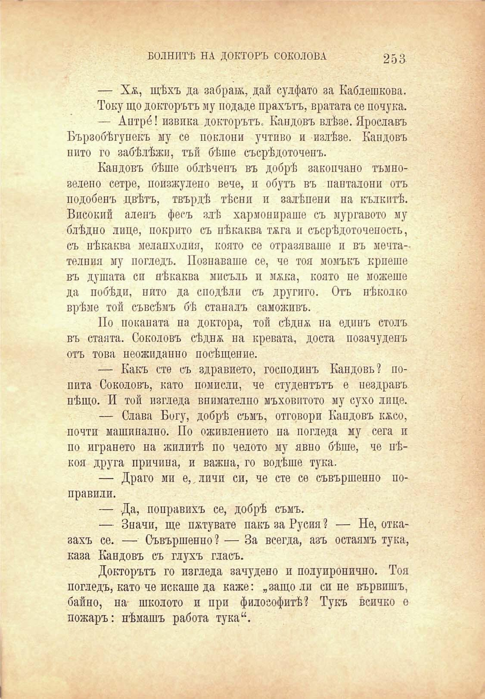

БОЛНИТѢ НА ДОКТОРЪ СОКОЛОВА	253

— Хж, щѣхъ да забраж, дай сулфате за Каблешкова. Току що докторътъ му подаде прахътъ, вратата се почука. — Антрб! извика докторътъ. Кандовъ влѣзе. Ярославъ Бързобѣгунекъ му се поклони учтиво и излѣзе. Кандовъ пито го забѣлѣжи, тъй бѣше съсрѣдоточенъ.

Кандовъ бѣше облѣченъ въ добрѣ заколвано тъмнозелепо сетре, поизжулено вече, и обутъ въ панталони отъ подобенъ цвѣтъ, твърдѣ тѣсни и залѣпени на кълкитѣ. Високий аленъ фесъ злѣ хармонираше съ мургавото му блѣдно лице, покрито съ нѣкаква тяга и съсрѣдоточеность, съ нѣкаква меланхолия, която се отразяваше и въ мечтателния му погледъ. Познаваше се, че тоя момъкъ криеше въ душата си нѣкаква мисъль и мяка, която не можеше да побѣди, нито да сподѣли съ другиго. Отъ нѣколко врѣме той съвсѣмъ бѣ станалъ саможивъ.

По поканата на доктора, той сѣднж на единъ столъ въ стаята. Соколовъ сѣднж на кревата, доста позачуденъ отъ това неожидапно посѣщение.

— Какъ сте съ здравието, господинъ Кандовь? попита Соколовъ, като помисли, че студентътъ е нездравъ нѣщо. И той изгледа внимателно мъховптото му сухо лице.

— Слава Богу, добрѣ съмъ, отговори Кандовъ кжсо, почти машинално. По оживлението па погледа му сега п по игрането на жилитѣ по челото му явно бѣше, че нѣкоя друга причина, и важна, го водѣше тука.

— Драго ми е, личи си, че сте се съвършенпо поправили.

— Да, поправихъ се, добрѣ съмъ.

— Значи, ще пѫтувате пакъ за Русия ? — Не, отказахъ се. — Съвършенпо? — За всегда, азъ остаямъ тука, каза Кандовъ съ глухъ гласъ.

Докторътъ го изгледа зачудено и поду иронично. Тоя погледъ, като че искаше да каже: „защо ли сипе вървишъ, байно, на школото и при философитѣ? Тукъ всичко е пожаръ: нѣмашъ работа тука“.

