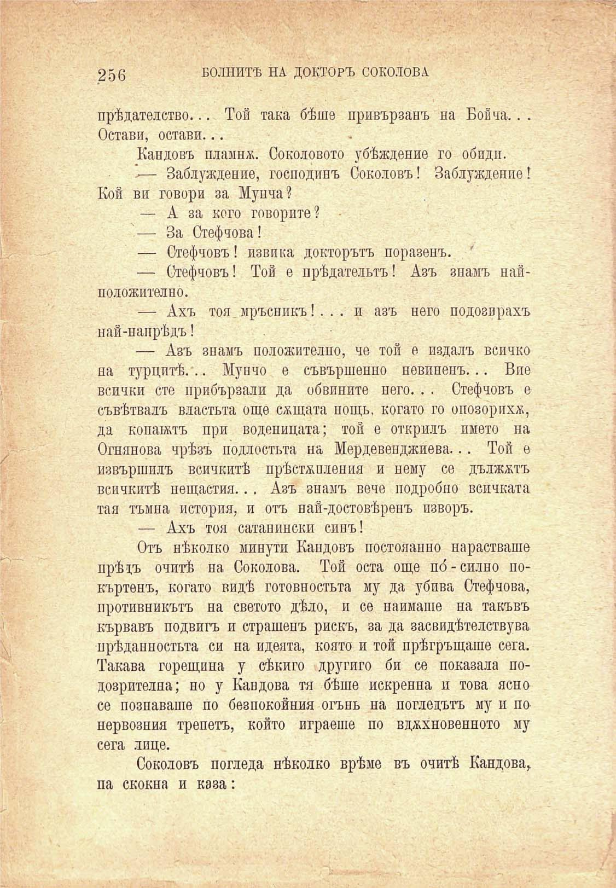

256	БОЛНИТѢ НА ДОКТОРЪ СОКОЛОВА

прѣдателство... Той така бѣше привързанъ на Бойча. . . Остави, остави...

Кандовъ пламнж. Соколовото убѣждение го обиди.

-— Заблуждение, господинъ Соколовъ! Заблуждение! Кой ви говори за Мупча?

— А за кого говорите?

— За Стефчова!

— Стефчовъ! извика докторътъ поразенъ. '

— Стефчовъ! Той е прѣдательтъ! Азъ знамъ найположително.

— Ахъ тоя мръсникъ!.. . и азъ него подозирахъ най-напрѣдъ!

— Азъ знамъ положително, че той е издалъ всичко на турцитѣ. .. Мунчо е съвършеппо невиненъ... Вие всички сте прибързали да обвините него. . . Стефчовъ е съвѣтвалъ властьта още сѫщата нощь, когато го опозорихъ, да копаятъ при воденицата; той е открилъ името на Огнянова чрѣзъ подлостьта на Мердевепджиева... Той е извършилъ всичкитѣ прѣстѫпления и нему се дължътъ всичкитѣ нещастия.. . Азъ знамъ вече подробно всичката тая тъмна история, и отъ най-достовѣренъ изворъ.

— Ахъ тоя сатанински синъ!

Отъ нѣколко минути Кандовъ постояапно нарастваше прѣзъ очитѣ на Соколова. Той оста още по́-силно покъртенъ, когато видѣ готовностьта му да убива Стефчова, противникътъ на светото дѣло, и се наимаше на такъвъ кървавъ подвигъ и страшенъ рискъ, за да засвидѣтелствува прѣданностьта си на идеята, която и той прѣгръщаше сега. Такава горещина у сѣкиго другиго би се показала подозрителна; но у Бандова тя бѣше искренна и това ясно се познаваше по безпокойния огънь на погледътъ му и по нервозния трепетъ, който играеше по вдъхновението му сега лице.

Соколовъ погледа нѣколко врѣме въ очитѣ Бандова,.

па скокна и каза:

