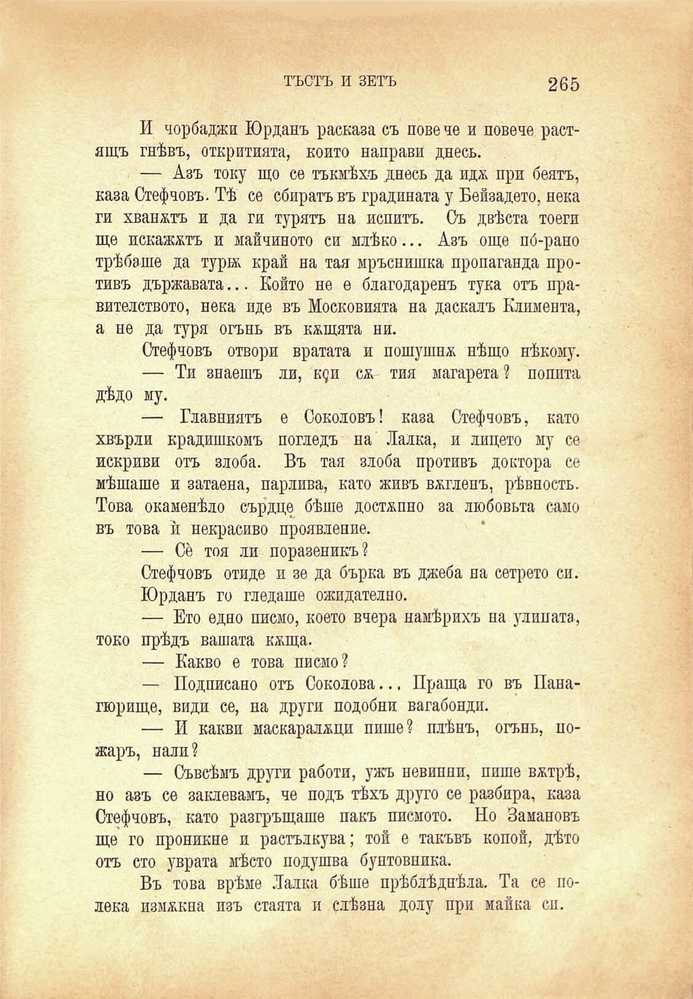

ТЪСТЪ И ЗЕТЪ

265

И чорбаджи Юрданъ расказа съ повече и повече растящъ гнѣвъ, откритията, който направи днесъ.

— Азъ току що се тъкмѣхъ днесъ да иди при беятъ, каза Стефчовъ. Тѣ се сбиратъ въ градината у Бейзадето, нека ги хванатъ и да ги турятъ на непитъ. Съ двѣста тоеги ще искажнтъ и майчиното си млѣко... Азъ още по́-рано трѣбаше да тура край на тая мръснишка пропаганда противъ държавата... Който не е благодаренъ тука отъ правителството, нека иде въ Московията на даскалъ Климента, а не да туря огънь въ кнщята ни.

Стефчовъ отвори вратата и пошушна нѣщо нѣкому.

— Ти знаешъ ли, к$и см тия магарета? поппта дѣдо му.

— Главниятъ е Соколовъ! каза Стефчовъ, като хвърли крадишкомъ погледъ на Лалка, и лицето му се покриви отъ злоба. Въ тая злоба противъ доктора се мѣшаше и затаена, парлива, като живъ вѫгленъ, рѣвность. Това окаменѣло сърдце бѣше достѫпно за любовьта само въ това ѝ некрасиво проявление.

— Се тоя ли поразеникъ?

Стефчовъ отиде и зе да бърка въ джеба на сетрето си.

Юрданъ го гледаше ожидателно.

— Ето едно писмо, което вчера намѣрихъ на уликата, токо прѣдъ вашата кжща.

— Какво е това писмо?

— Подписано отъ Соколова... Праща го въ Панагюрище, види се, на други подобни вагабондп.

— И какви маскаралжци пише? плѣнъ, огънь, пожаръ, нали?

— Съвсѣмъ други работи, ужъ невинни, пише внтрѣ, но азъ се заклевамъ, че подъ тѣхъ друго се разбира, каза Стефчовъ, като разгръщаше пакъ писмото. Но Замановъ ще го проникне и разтълкува; той е такъвъ копой, дѣто отъ сто уврата мѣсто подушва бунтовника.

Въ това врѣме Лалка бѣше прѣблѣднѣла. Та се полека измъкна изъ стаята и слѣзна долу при майка си.

