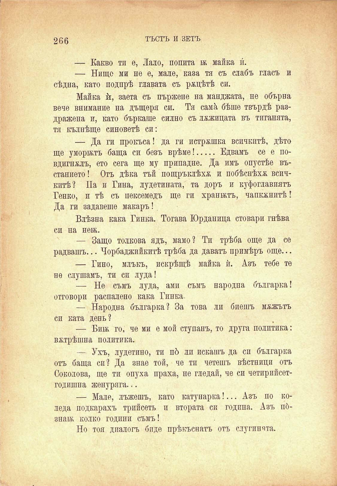

266

ТЪСТЪ И ЗЕТЪ

— Какво ти е, Лало, попита ж майка и.

— Нищо ми не е, мале, каза тя съ слабъ гласъ и сѣдна, като подпрѣ главата съ рѫцѣтѣ си.

Майка й, заета съ пържене на манджата, не обърна вече внимание на дъщеря си. Тя самѝ бѣше твърдѣ раздражена и, като бъркаше силно съ лъжицата въ тиганята, тя кълнѣще синоветѣ си:

— Да ги прокъса! да ги истржшка всичкитѣ, дѣто ще уморилъ баща си безъ врѣме!........ Едвамъ се е по-

вдигнжлъ, ето сега ще му припадне. Да имъ опустѣе въстанието! Отъ дѣка тъй пощръклѣха и побѣснѣха всичкитѣ? Па и Гина, лудетината, та доръ и куфоглавиятъ Генко, и тѣ съ пексемедъ ще ги хранятъ, чапкънитѣ I Да ги задавете макаръ!

Влѣзна кака Гинка. Тогава Юрданица стовари гнѣва си на неш.

— Защо толкова ядъ, мамо? Ти трѣба още да се радвашъ... Чорбаджийкитѣ трѣба да даватъ примѣръ още...

— Гино, млъкъ, искрѣщѣ майка ѝ. Азъ тебе те не слушамъ, ти си луда!

— Не съмъ луда, ами съмъ народна българка! отговори распалено кака Гинка.

— Народна българка? За това ли биешъ мѫжътъ сп ката день?

— Бий; го, че ми е мой ступанъ, то друга политика: вѫтрѣшна политика.

— Ухъ, лудетино, ти по́ ли искашъ да си българка отъ баща си? Да знае той, че ти четешъ вѣстници отъ Соколова, ще ти опуха праха, не гледай, че си четирийсетгодишна женуряга...

— Мале, лъжешъ, като катунарка!... Азъ по коледа подкарахъ трийсеть и втората си година. Азъ пбзнан; колко години съмъ!

Но тоя диалогъ бпде прѣкѫснатъ отъ слугинята.

