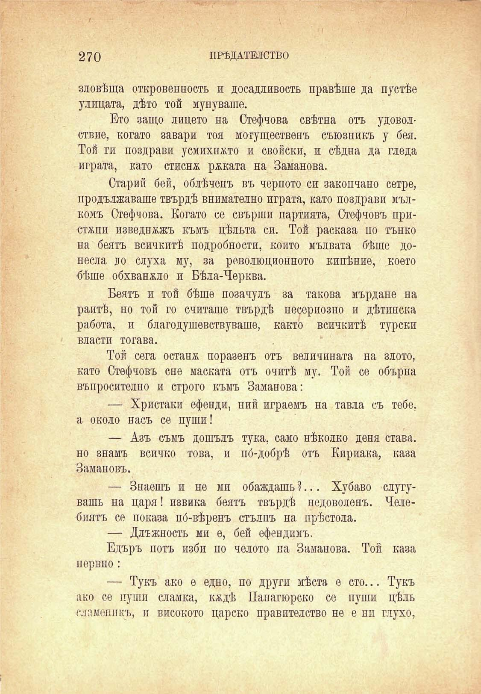

270	ПРѢДАТЕЛСТВО

зловѣща откровеность и досадливость правѣше да пустѣе улицата, дѣто той мунуваше.

Ето защо лицето на Стефчова свѣтна отъ удоволствие, когато завари тоя могущественъ съюзникъ у бея. Той ги поздрави усмихнато и свойски, и сѣдна да гледа играта, като стисна рѣката на Заманова.

Старий бей, облѣченъ въ черното си закопчано сетре, продължаваше твърдѣ внимателно играта, като поздрави мълкомъ Стефчова. Когато се свърши партията, Стефчовъ пристжпи изведнъжъ къмъ цѣльта си. Той расказа по тънко на беятъ всичкитѣ подробности, който мълвата бѣше донесла до слуха му, за революционното кипѣние, което бѣше обхванжло и Бѣла-Черква.

Беятъ и той бѣше позачулъ за такова мърдане на раитѣ, но той го считаше твърдѣ несериозно и дѣтинска работа, и благодушевствуваше, както всичкитѣ турски власти тогава.

Той сега останж поразенъ отъ величината на злото, като Стефчовъ сне маската отъ очитѣ му. Той се обърна въпросително и строго къмъ Заманова:

— Христаки ефенди, ний играемъ на тавла съ тебе, а около насъ се пуши!

— Азъ съмъ дошълъ тука, само нѣколко деня става, но знамъ всичко това, и по́-добрѣ отъ Кириака, каза Замановъ.

— Знаешъ и не ми обаждашь ?... Хубаво слугувашь на царя! извика беятъ твърдѣ педоволенъ. Челебпятъ се показа по́-вѣренъ стълпъ на прѣстола.

— Длъжность ми е, бей ефендимъ.

Едъръ поть изби по челото па Заманова. Той каза нервно :

— Тукъ ако е едно, по други мѣста е сто... Тукъ ако се пуши сламка, кждѣ Папагюрско се пуши цѣль сламеникъ, и високото царско правителство не е пи глухо,

