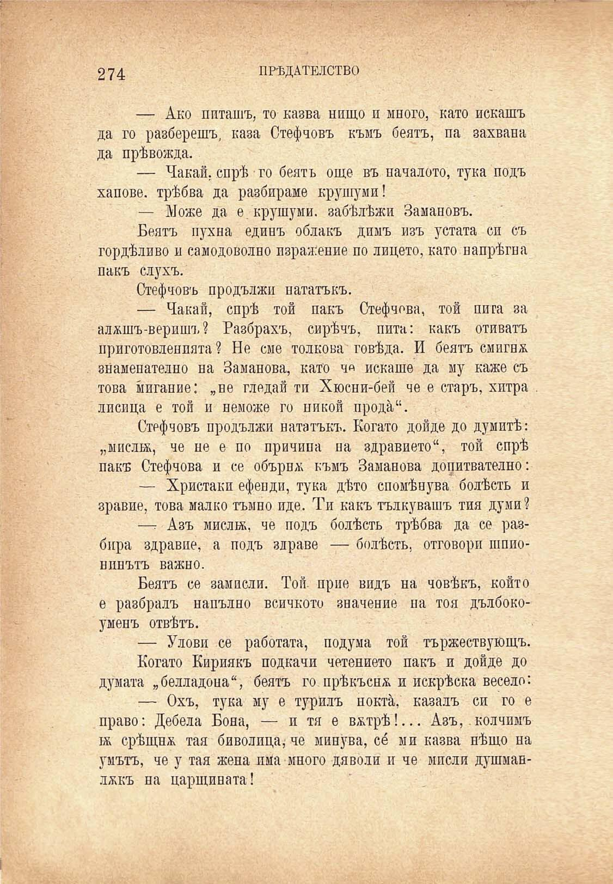

ПРѢДАТЕЛСТВО

274

искашъ захвана

— Ако питашъ, то казва нищо и много, като да го разберешъ, каза Стефчовъ къмъ беятъ, па да прѣвожда.

— Охъ, тука му е турилъ ноктѝ, казалъ си го е право: Дебела Бона, — и тя е в&трѣ!... Азъ, . колчимъ ж срѣщна тая биволица, че мину́ва, со́ ми казва нѣщо на умътъ, че у тая жена има много дяволи и че мисли душманл&къ на царщината!

— Чакай, спрѣ го беятъ още въ началото, тука подъ хапове, трѣбва да разбираме крушуми!

— Може да е. крушуми. забѣлѣжи Замановъ.

Беятъ пухна единъ облакъ димъ изъ устата си съ гордѣливо и самодоволно пзрая:ение по лицето, като напрѣгна пакъ слухъ.

Стефчовъ продължи нататъкъ.

— Чакай, спрѣ той пакъ Стефчова, той пита за алжшъ-веришъ ? Разбрахъ, сирѣчъ, пита: какъ отиватъ приготовленията? Не сме толкова говѣда. И беятъ смигна знаменателно на Заманова, като ч« искаше да му каже съ това ѝигание: „не гледай ти Хюсни-бей че е старъ, хитра . лисица е той и неможе го никой продѝ“.

Стефчовъ продължи нататъкъ. Когато дойде до думитѣ: „мислбь, че не е по причина на здравното“, той спрѣ пакъ Стефчова и се обърна къмъ Заманова допитвателно:

— Христаки ефенди, тука дѣто спомѣнува болѣсть и зравие, това малко тъмно иде. Ти какъ тълкувашъ тия думи?

—: Азъ мисли*, че подъ болѣсть трѣбва да се разбира здравно, а подъ здраве — болѣсть, отговори шпионинътъ важно.

Беятъ се замисли. Той. прие видъ на човѣкъ, който е разбралъ напълно всичкото значение па тоя дълбокоуменъ отвѣтъ.

— Улови се работата, подума той тържествующъ.

Когато Кириякъ подкачи четението пакъ и дойде до думата „белладона“, беятъ го прѣкъсн^ и искрѣска весело:

