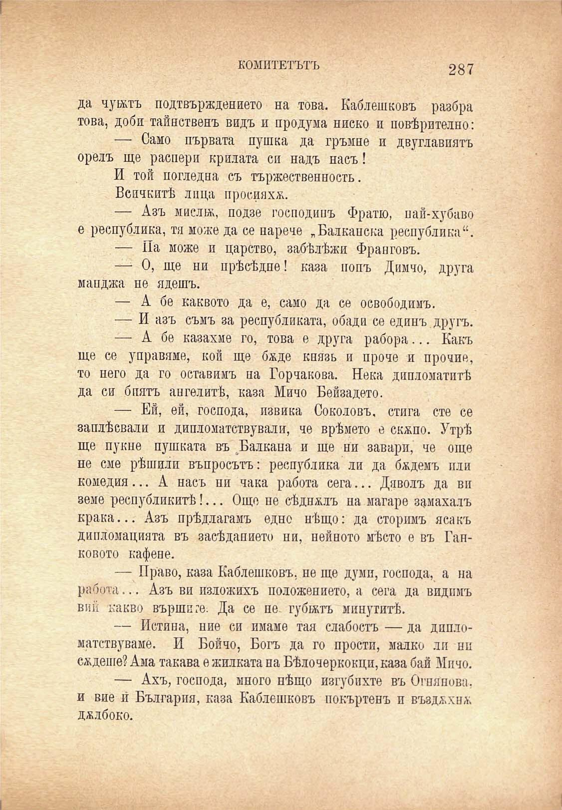

КОМИТЕТЪТЪ

287

да чукътъ подтвърждението на това. Каблешковъ разбра това, доби тайнственъ видъ и продума ниско и повѣрително:

— Само първата пушка да гръмне и двуглавиятъ орелъ ще распери крилата си надъ насъ!

И той погледна съ тържествен постъ.

Всичкитѣ лица просияха.

— Азъ мислнк, подзе господинъ Фратю, пай-хубаво е республика, тя може да се нарече „Балканска республика“.

— Па може и царство, забѣлѣжи Франговъ.

— О, ще ни прѣсѣдне! каза попъ Димчо, друга манджа не ядешъ.

— А бе каквото да е, само да се освободимъ.

— И азъ съмъ за републиката, обади се единъ другъ.

— А бе казахме го, това е друга рабора... Какъ ще се управяме, кой ще баде князь и проче и прочие, то него да го оставимъ па Горчакова. Нека дипломатитѣ да си биятъ ангелитѣ, каза Мичо Бейзадето.

— Ей, ей, господа, извика Соколовъ, стига сте се заплѣсвали и дипломатствували, че врѣмето е скжпо. Утрѣ ще пукне пушката въ Балкана и ще ни завари, че още не сме рѣшили въпросътъ: республика ли да бадемъ пли комедия... А насъ ни чака работа сега... Дяволъ да ви земе республикитѣ!... Още не сѣдимъ на магаре замахалъ крака... Азъ прѣдлагамъ едно нѣщо: да сторимъ ясакъ дипломацията въ засѣданието ни, нейното мѣсто е въ Ганковото кафене.

— Право, каза Каблешковъ, не ще думи, господа, а на работа... Азъ ви изложихъ положението, а сега да видимъ вий какво вършите. Да се не. губятъ минутитѣ.

— Истина, ние си имаме тая слабость — да дппломатствуваме. И Бойчо, Богъ да го прости, малко ли ни садете? Ама такава е жилката на Бѣлочеркокци, каза бай Мичо.

— Ахъ, господа, много нѣщо изгубихте въ Огнянова, и вие й България, каза Каблешковъ покъртенъ и въздъхна; дълбоко.

