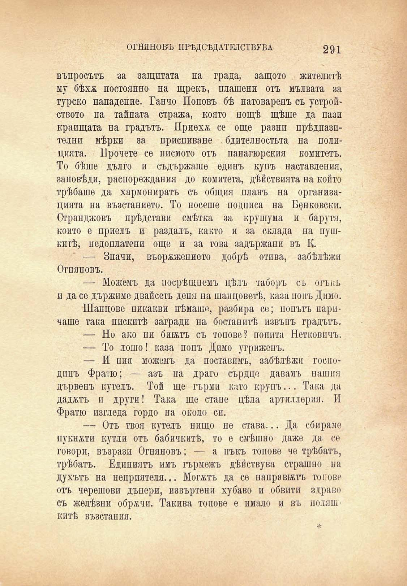

ОГНЯНОВЪ ПРѢДСѢДАТЕЛСТВУВА

291

въпросътъ за защитата на града, защото жителитѣ му бѣхя постоянно на щрекъ, платени отъ мълвата за турско нападение. Ганчо Поповъ бѣ натоваренъ съ устройството на тайната стража, която нощѣ щѣше да пази краищата на градътъ. Приеха се още разни прѣдпазителни мѣрки за приспиване . бдителностьта на полпцията. Прочете се писмото отъ панагюрския комитетъ. То бѣше дълго и съдържаше единъ купъ наставления, заповѣди, распореждания до комитета, дѣйствията на който трѣбаше да хармониратъ съ общия планъ на организацията на възстанието. То носете подписа на Банковски. Странджовъ прѣдстави смѣтка за крушума и барути, който е приелъ и раздалъ, както и за склада на пушкитѣ, недоплатени още и за това задържани въ К.

— Значи, въорѫжението добрѣ отива, забѣлѣжи Огняновъ.

— Можемъ да посрѣщнемъ цѣлъ таборъ съ огънь и да се държиме двайсеть деня на шанцоветѣ, каза попъ Димо.

Шанцове никакви нѣмаше, разбира се; попътъ наричаше така нискитѣ загради на бостанитѣ извънъ градътъ.

— Но ако ни бикътъ съ топове? попита Нетковичъ. — То лошо! каза попъ Димо угриженъ.

— И пия можемъ да поставимъ, забѣлѣжи господипъ Фратю; — азъ на драго сърдце давамъ нашия дървенъ кутелъ. Той ще гърми като крупъ... Така да дадатъ и други! Така ще стане цѣла артиллерия. И Фратю изгледа гордо на около си.

— Отъ твоя кутелъ нищо не става... Да сбираме пукнАти кутди отъ бабичкитѣ, то е смѣшно даже да се говори, възрази Огняновъ; — а пъкъ топове че трѣбятъ, трѣбятъ. Единиятъ имъ гърмежъ дѣйствува стряшно на духътъ на неприятеля... Могатъ да се напра ватъ токове отъ черешови дънери, извъртепи хубаво и обвити здраво съ желѣзни обречи. Такива топове е имало и въ понятнитѣ възстания.

