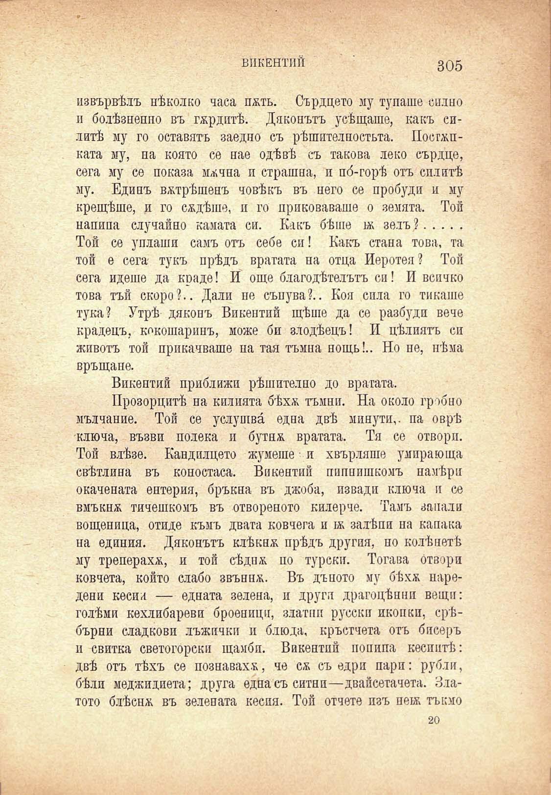

ВИКЕНТИЙ

305

извървѣлъ нѣколко часа пжть. Сърдцето му тупаше силно и болѣзненно въ гжрдптѣ. Дяконътъ усѣщаше, какъ силитѣ му го оставятъ заедно съ рѣшителпостьта. Посгжпката му, на която се нае одѣвѣ съ такова леко сърдце, сега му се показа мжчна и страшна, и по́-горѣ отъ силитѣ му. Единъ вжтрѣшенъ човѣкъ въ него се пробуди и му крещѣше, и го садѣше, и го приковаваше о земята. Той напипа случайно камата си. Какъ бѣше бк зелъ ?......... Той се уплаши самъ отъ себе си! Какъ стана това, та той е сега- тукъ прѣдъ вратата на отца Иеротея? Той сега идеше да краде! И още благодѣтелътъ си! И всичко това тъй скоро?.. Дали пе сънува?.. Коя спла го тикаше тука? Утрѣ дяконъ Викентий щѣше да се разбуди вече крадецъ, кокошаринъ, може би злодѣецъ! И цѣлиятъ си животъ той прикачваше на тая тъмна нощь!.. Но не, нѣма връщане.

Викентий приближи рѣшително до вратата.

Прозорцитѣ на килията бѣхѫ тъмни. На около гробно мълчание. Той се услушва́ една двѣ минути,, па оврѣ ключа, възви полека и бутнж вратата. Тя се отвори. Той влѣзе. Кандилцето жумете и хвърляше умира ю ща свѣтлина въ коностаса. Викентий пипнишкомъ намѣри окачената ентерия, бръкна въ джоба, извади ключа и се вмъкнж тичешкомъ въ отвореното килерче. Тамъ запали вощеница, отиде къмъ двата ковчега и бк залѣпи на капака на единия. Дяконътъ клѣкнж прѣдъ другия, по колѣнетѣ му треперахж, и той сѣднж по турски. Тогава отвори ковчета, който слабо звънпж. Въ дъното му бѣхѫ наредени кесии — едната зелена, и други драгоцѣннп вещи: голѣми кехлибареви броеници, златпп русски иконки, ерѣбърни сладкови лъжички и блюда, кръстчета отъ бисеръ м свитка светогорски щамбп. Викентий попипа кесиитѣ: двѣ отъ тѣхъ се познаваха, че сѫ съ едри пари: рубли, бѣли меджидиета; друга една съ ситни—двайсетачета. Златото блѣснж въ зелената кесия. Той отчете пзъ нобк тъкмо

20

