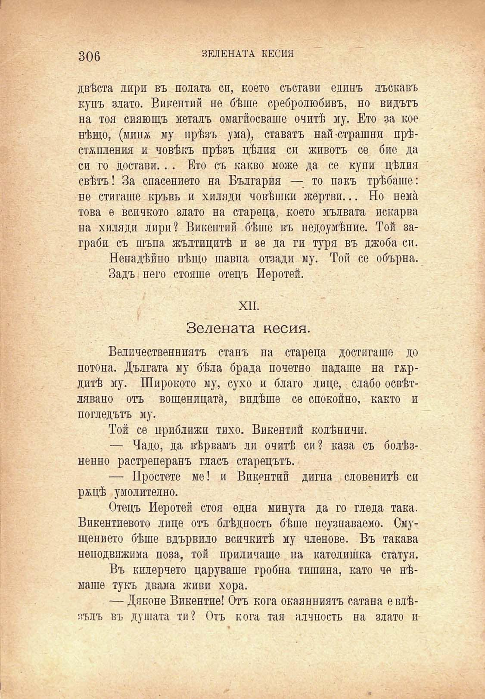

ЗЕЛЕНАТА КЕСИЯ

306

■ »

№

двѣста лири въ полата си, поето състави единъ лъскавъ купъ злато. Викентий не бѣше сребролюбивъ, но видътъ на тоя сияющъ металъ омагйосваше очитѣ му. Ето за кое нѣщо, (минж му прѣзъ ума), ставатъ най страшни прѣстжпления и човѣкъ прѣзъ цѣлия си животъ се бие да си го достави.. . Ето съ какво може да се купи цѣлия свѣтъ! За спасението на България — то пакъ трѣбаше: не стигаше кръвь и хиляди човѣшки жертви... Но пемѝ това е всичкото злато на стареца, което мълвата искарва на хиляди лири? Викентий бѣше въ недоумѣние. Той заграби съ шъпа жълтицитѣ и зе да ги туря въ джоба си.

Ненадѣйно нѣщо шавна отзади му. Той се обърна. Задъ него стояше отецъ Иеротеѝ.

ЙЙ<>

1и^/ :

к*

№

к

XII.

Зелената кесия.

Величественниятъ станъ на стареца достигаше до потона. Дългата му бѣла брада почетно падаше на гжрдитѣ му. Широкото му, сухо и благо лице, слабо освѣтлявано отъ вощеницата, видѣше се спокойно, както и погледътъ му.

Той се приближи тихо. Викентий колѣничи.

— Чадо, да вѣрвамъ ли очитѣ си? каза съ болѣзненно растреперанъ гласъ старецътъ.

— Простете ме! и Викрптий дигна словенитѣ си ржцѣ умолително.

Отецъ Иеротей стоя една минута да го гледа така. Викентиевото лице отъ блѣдность бѣше неузнаваемо. Смущението бѣше вдървило всичкитѣ му членове. Въ такава неподвижния поза, той приличаше на католишка статуя.

Въ килерчето царуваше гробна тишина, като че нѣмаше тукъ двама живи хора.

— Дяконе Викентие! Отъ кога окаляниятъ сатана евлѣзълъ въ душата ти? Отъ кога тая алчность на злато и

Я

. .	V /	.	V Н ’ '

