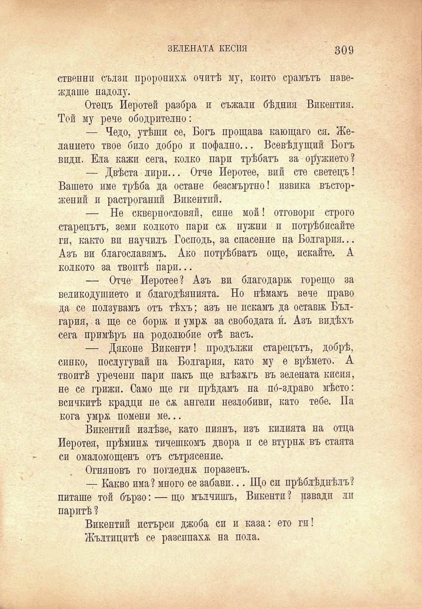

ЗЕЛЕНАТА КЕСИЯ

309

ственни сълзи проронихѫ очитѣ му, който срамътъ навеждаше надолу.

Отецъ Иеротей разбра и съжали бѣдния Викентия. Той му рече ободрително:

— Чедо, утѣши се, Богъ прощава каютцаго ся. Желанието твое било добро и пофално... Всевѣдущий Богъ види. Ела кажи сега, колко пари трѣбятъ за орѫжието?

— Двѣста лири... Отче Иеротее, вий сте светецъ! Вашето име трѣба да остане безсмъртно! извика въсторжений и растроганий Викентий.

— Не сквернословия, сине мои! отговори строго старецътъ, земи колкото пари сѫ нужни и потрѣбисайте ги, както ви научилъ Господь, за спасение на Болгария... Азъ ви благославямъ. Ако потрѣбватъ още, искайте. А колкото за твоитѣ пари...

— Отче- Иеротее? Азъ ви благодари; горещо за великодушието и благодѣянията. Но нѣмамъ вече право да се ползувамъ отъ тѣхъ; азъ не искамъ да остави; България, а ще се бортж и умрж за свободата и́. Азъ видѣхъ сега примѣръ на родолюбие отѣ васъ.

— Дяконе Виконти! продължи старецътъ, добрѣ, синко, послугувай на Болгария, като му е врѣмето. А твоитѣ уречени пари пакъ ще влѣзжгъ въ зелената кисия, не се грижи. Само ще ги прѣдамъ на по́-здраво мѣсто: всичкитѣ крадци пе сѫ ангели незлобиви, като тебе. Па кога умрж помени ме...

Викентий излѣзе, като пиянъ, изъ килията на отца Иеротея, прѣминж тичешкомъ двора и се втурнж въ стаята си омаломощенъ отъ сътрясение.

Огняновъ го погледнж поразенъ.

— Какво има? много се забави... Що си прѣблѣдпѣлъ? питаше той бързо: — що мълчишъ, Виконти ? рзвадп лп паритѣ ?

Викентий потърси джоба си и каза: ето ги!

Жълтицитѣ се разсппахж на пола.

