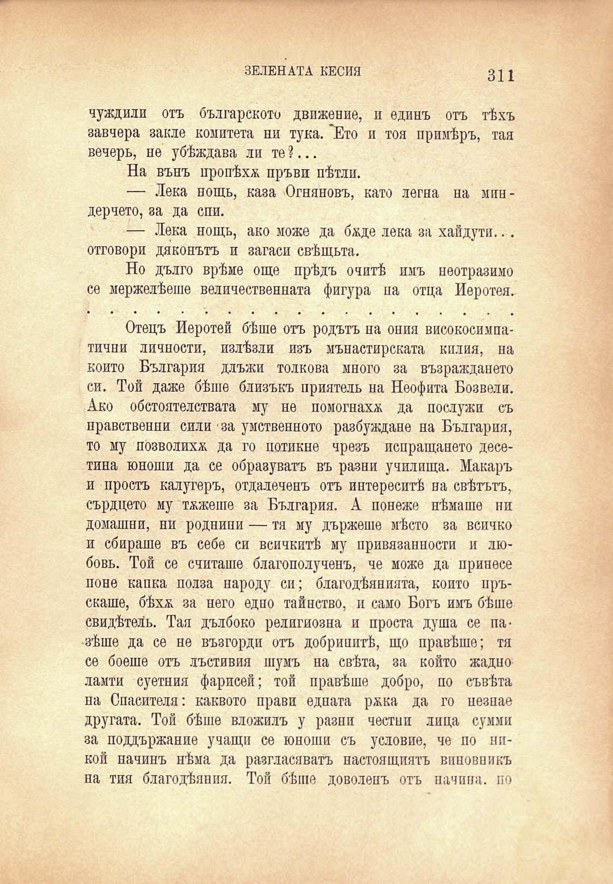

ЗЕЛЕНАТА КЕСИЯ	311

чуждили отъ българското движение, и единъ отъ тѣхъ завчера закле комитета ни тука. 'Ето и тоя примѣръ, тая вечерь, не убѣждава ли те ?...

На вънъ пропѣха пръви пѣтли.

— Лека нощь, каза Огняновъ, като легна на миндерчето, за да спи.

— Лека нощь, ако може да бѫде лека за хайдути... отговори дяконътъ и загаси свѣщьта.

Но дълго врѣме още прѣдъ очитѣ имъ неотразимо се мержелѣеше величественната фигура па отца Иеротея.

Отецъ Иеротей бѣше отъ родътъ на ония високосимпатични личности, излѣзли изъ мънастирската кплия, на който България длъжи толкова много за възраждането си. Той даже бѣше близъкъ приятель на Неофита Бозвели. Ако обстоятелствата му не помогнаха да послужи съ правственни сили ■ за умственното разбуждане на България, то му позволихѫ да го потикне чрезъ испращането десетина юноши да се образуватъ въ разни училища. Макаръ и простъ калугеръ, отдалеченъ отъ интереситѣ на свѣтътъ, сърдцето му тежеше за България. А понеже нѣмаше ни домашни, ни роднини — тя му държеше мѣсто за всичко и сбираше въ себе си всичкитѣ му привязанности и любовь. Той се считаше благополученъ, че може да принесе поне капка полза народу си; благодѣянията, който пръскаше, бѣхѫ за него едно тайнство, и само Богъ имъ бѣше свидѣтель. Тая дълбоко религиозна и проста душа се пазѣше да се не възгорди отъ добринитѣ, що правѣше; тя се боеше отъ лъстивия шумъ на свѣта, за който жадно ламти суетния фарисей; той правѣше добро, по съвѣта на Спасителя: каквото прави едната ржка да го незпае другата. Той бѣше вложилъ у разни честни лица сумми за поддържание учащи се юноши съ условие, че по нпкой начинъ нѣма да разгласяватъ настоящиятъ виновникъ на тия благодѣяния. Той бѣше доволенъ отъ начина, по

