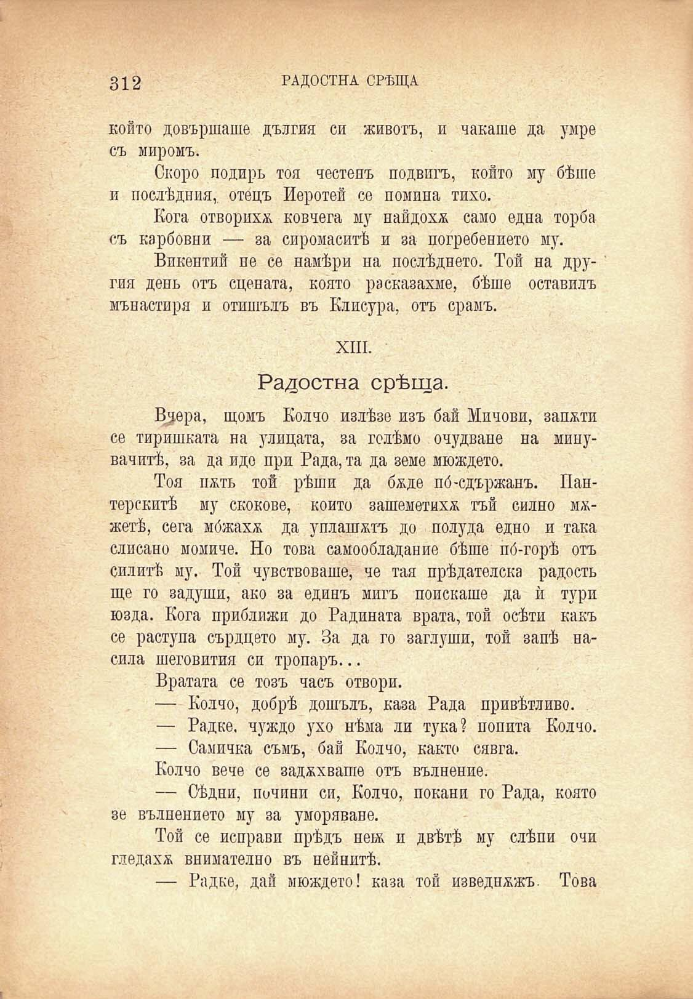

312

РАДОСТНА СРѢЩА

който довършаше дългия си животъ, и чакаше да умре съ миромъ.

Скоро подиръ тоя честенъ подвихъ, който му бѣше и послѣдния,, отецъ Иеротей се помина тихо.

Кога отворихѫ ковчега му найдохѫ само една торба съ карбовни — за сиромаситѣ и за погребението му.

Викентий не се намѣри па послѣднето. Той на другия день отъ сцената, която ра оказахме, бѣше оставилъ мънастиря и отишълъ въ Клисура, отъ срамъ.

XIII.

Радостна срѣща.

В^ера, щомъ Колчо излѣзе изъ бай Мичови, запоти се тиришката на улицата, за голѣмо очудване на минувачитѣ, за да иде при Рада, та да земе мюждето.

Тоя пжть той рѣши да бѫде по́-сдържанъ. Пантерскитѣ му скокове, който зашеметихѫ тъй силно мѫжетѣ, сега мбжахж да уплашатъ до полуда едно и така слисано момиче. Но това самообладание бѣше по́-горѣ отъ силитѣ му. Той чувствоваше, че тая прѣдателска радость ще го задуши, ако за единъ мигъ поискаше да ѝ тури юзда. Кога приближи до Радината врата, той осѣти какъ се раступа сърдцето му. За да го заглуши, той запѣ насила шеговития си тропаръ...

Вратата се тозъ часъ отвори.

— Колчо, добрѣ дошълъ, каза Рада привѣтливо.

— Радке. чуждо ухо нѣма ли тука? попита Колчо.

— Самичка съмъ, бай Колчо, както сявга.

Колчо вече се задухваше отъ вълнение.

— Сѣдни, почини си, Колчо, покани го Рада, която зе вълнението му за уморяване.

Той се неправи прѣдъ нехж и двѣтѣ му слѣпи очи гледахж внимателно въ нейнитѣ.

— Радке, дай мюждето! каза той изведнъжъ. Това

