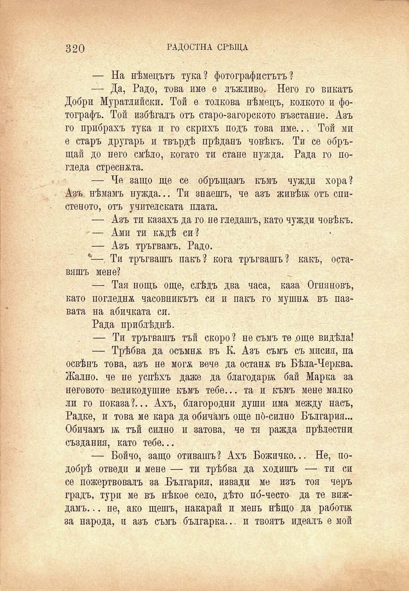

320	РАДОСТНА СРѢЩА

— На нѣмецътъ тука? фотографистътъ ?

— Да, Радо, това име е лъжливо. Него го викатъ Добри Муратлийски. Той е толкова нѣмецъ, колкото и фотографъ. Той избѣгалъ отъ старо-загорското възстание. Азъ го прибрахъ тука и го скрихъ подъ това име... Той ми е старъ другарь и твърдѣ прѣданъ човѣкъ. Ти се обръщай до него смѣло, когато ти стане нужда. Рада го погледа стреснжта.

— Че защо ще се обръщамъ къмъ чужди хора? Азъ. нѣмамъ нужда... Ти знаешъ, че азъ живѣй; отъ спистеното, отъ учителската плата.

— Азъ ти казахъ да го не гледашъ, като чужди човѣкъ.

— Ами ти кждѣ си?

— Азъ тръгвамъ. Радо.

*—, Ти тръгвашъ пакъ? кога тръгвашъ? какъ, оставяшъ мене?

— Тая нощь още, слѣдъ два часа, каза Огняновъ, като погледна часовникътъ си и пакъ го мушнж въ пазвата на абичката си.

Рада приблѣднѣ.

— Ти тръгвашъ тъй скоро ? не съмъ те .още видѣла!

— Трѣбва да осъмнж въ К. Азъ съмъ съ мисия, па освѣнъ това, азъ не могж вече да останж въ Бѣла-Черква. Жално, че не успѣхъ даже да благодари; бай Марка за неговото великодушие къмъ тебе... та и къмъ мене малко ли го показа?... Ахъ, благородни души има между насъ, Радке, и това ме кара да обичамъ още по́-силно България... Обичамъ й; тъй силно и затова, че тя ражда прѣлестни създания, като тебе...

— Бойчо, защо отивашъ? Ахъ Божичко... Не, подобрѣ отведи и мене — ти трѣбва да ходишъ — ти си се пожертвовалъ за България, извади ме изъ тоя черъ градъ, тури ме въ нѣкое село, дѣто по́-често да те виждамъ. .. не, ако щешъ, накарай и мень нѣщо да работа за народа, и азъ съмъ българка... и твоятъ идеалъ е мой

