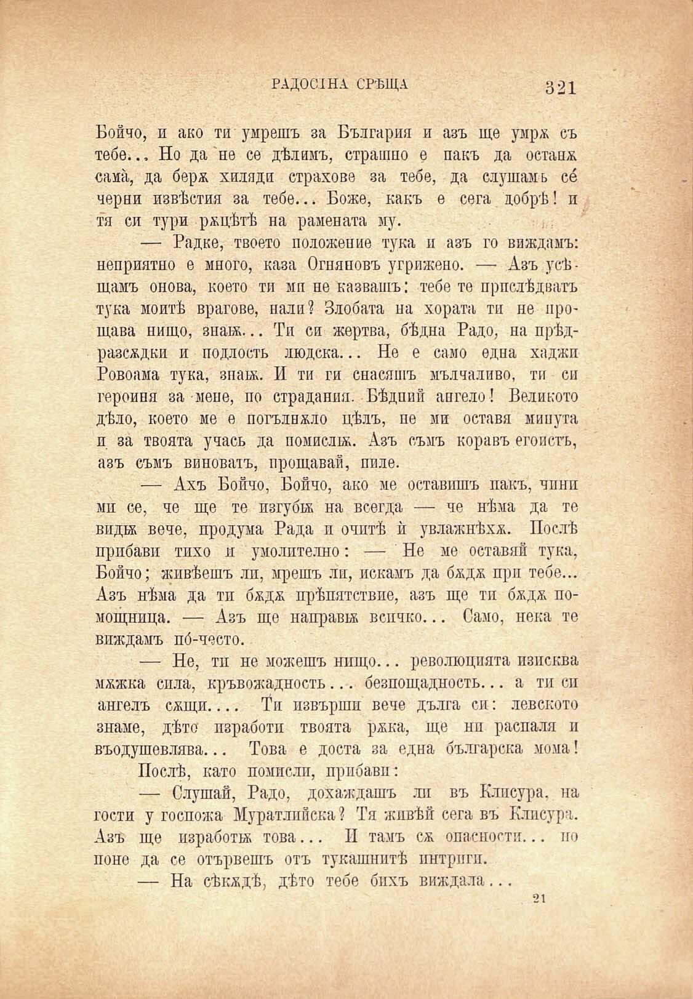

РАДОСТНА СРѢЩА

321

Бойчо, и ако ти умрешъ за България и азъ ще умрж съ тебе... Но да не се дѣлимъ, страшно е пакъ да остана сама, да берж хиляди страхове за тебе, да слушамь се черни извѣстия за тебе... Боже, какъ е сега добрѣ! и тя си тури рѫцѣтѣ на рамената му.	,:

— Радке, твоето положение тука и азъ го виждамъ: неприятно е много, каза Огняновъ угрижено. — Азъ усѣщамъ онова, което ти мп не казвашъ: тебе те прислѣдватъ тука моитѣ врагове, нали? Злобата на хората тп не прощава нищо, знай... Ти си жертва, бѣдна Радо, на прѣдразсждки и подлость людска... Не е само една хаджп Ровоама тука, зпан. И ти ги снасяшъ мълчаливо, ти си героиня за мене, по страдания. Бѣдпий апгело! Великото дѣло, което ме е погълнжло цѣлъ, пе ми оставя минута и за твоята учась да помисли. Азъ съмъ коравъ егоистъ, азъ съмъ виноватъ, прощавай, пиле.

— Ахъ Бойчо, Бойчо, ако ме оставишъ пакъ, чпнп мп се, че ще те изгуби на всегда — че нѣма да те види вече, продума Рада и очптѣ ѝ увлажнѣхж. Послѣ прибави тихо и умолително: — Не ме оставяй тука, Бойчо; живѣешъ ли, мрешъ ли, искамъ да бждж при тебе... Азъ нѣма да тп бждж прѣпятствие, азъ ще тп бждж помощница. — Азъ ще направи всичко... Само, нека те виждамъ по́-често.

— Не, тп не можешъ нищо... революцията изисква мжжка сила, кръвожадность... безпощадность... а тп сп ангелъ сжщи.... Ти извърши вече дълга си: левското знаме, дѣто изработи твоята ржка, ще ни распаля и въодушевлява... Това е доста за една българска мома!

Послѣ, като помисли, прибави:

— Слушай, Радо, дохаждашъ ли въ Клисура, на гости у госпожа Муратлпйска ? Тя живѣй сега въ Клисура. Азъ ще изработи това... II тамъ сѫ опасности... по поне да се отървешъ отъ тукашнитѣ интриги.

— На сѣкждѣ, дѣто тебе бихъ виждала...

21

