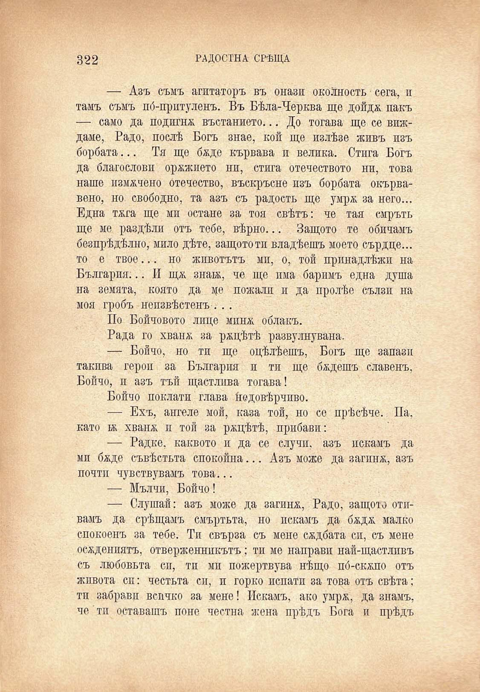

322

РАДОСТНА СРѢЩА

— Азъ съмъ агитаторъ въ онази околность сега, и тамъ съмъ по́-притуленъ. Въ Бѣла-Черква ще дойдж пакъ — само да подигнж въстанието... До тогава ще се виждаме, Радо, послѣ Богъ знае, кой ще излѣзе живъ изъ борбата... Тя ще бѫде кървава и велика. Стига Богъ да благослови орѫжието ни, стига отечеството ни, това наше измѫчено отечество, въскръсне изъ борбата окървавено, но свободно, та азъ съ радость ще умрж за него... Една тяга ще ми остане за тоя свѣтъ: че тая смръть ще ме раздѣли отъ тебе, вѣрно... Защото те обичамъ безпрѣдѣлно, мило дѣте, защото ти владѣешъ моето сърдце... то е твое... но животътъ ми, о, той принадлѣжи на България... И Щ/К знаа, че ще има баримъ една душа на земята, която да це пожали и да пролѣе сълзи на моя гробъ неизвѣстенъ . ..

По Бойчовото лице минж облакъ.

Рада го хванж за ржцѣтѣ развулнувана.

— Бойчо, но ти ще оцѣлѣешъ, Богъ ще запази такива герои за България и ти ще бѫдешъ Славенъ, Бойчо, и азъ тъй щастлива тогава!

Бойчо поклати глава ѝедовѣрчиво.

— Ехъ, ангеле мой, каза той, но се прѣсѣче. Па, като бь хванж и той за ржцѣтѣ, прибави:

— Радке, каквото и да се случи, азъ искамъ да ми бѫде съвѣстьта спокойна... Азъ може да загинж, азъ почти чувствувамъ това...

— Мълчи, Бойчо!

— Слушай: азъ може да загинж, Радо, защото отивамъ да срѣщамъ смъртьта, но искамъ да бждж малко спокоенъ за тебе. Ти свърза съ мене сждбата сп, съ мене осѫдениятъ, отверженнпкътъ; ти ме направи най-щастлпвъ съ любовьта сп, тп ми пожертвува нѣщо по́-скжпо отъ живота сп: честьта си, и горко испати за това отъ свѣта: тп забрави всичко за мене! Искамъ, ако умрж, да знамъ, че тп оставашъ поне честна жена прѣдъ Бога и прѣдъ

