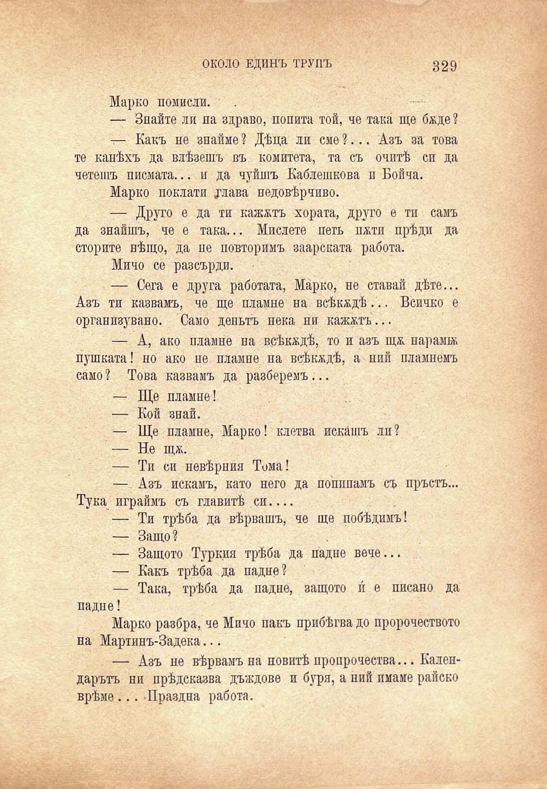

ОКОЛО ЕДИНЪ ТРУПЪ

329

Марко помисли.

— Знайте ли на здраво, попита той, че така ще бѫде ?

— Какъ не знайме ? Дѣца ли сме ?... Азъ за това те канѣхъ да влѣзешъ въ комитета, та съ очитѣ си да четешъ писмата... и да чуйшъ Каблешкова и Бойча.

Марко поклати удава недовѣрчиво.

— Друго е да ти кажжтъ хората, друго е ти самъ да знайшъ, че е така... Мислете петь пжти прѣди да сторите нѣщо, да пе повторимъ заарската работа.

Мичо се разсърди.

— Сега е друга работата, Марко, не ставай дѣте... Азъ ти казвамъ, че ще пламне на всѣкждѣ... Всичко е организувано. Само деньтъ нека ни кажжтъ...

— А, ако пламне на всѣкѫдѣ, то и азъ щж. нарамж

пушката! но само ? Това

— Кой

ако не пламне на всѣкѫдѣ, а ний пламнемъ казвамъ да разберемъ...

пламне!

знай.

— Ще пламне, Марко! клетва искашъ ли?

— Не щж.

— Ти си невѣрния Тома!

— Азъ искамъ, като него да попипамъ съ пръстъ... Тука играймъ съ главитѣ си....

— Ти трѣба да вѣрвашъ, че ще побѣлимъ!

— Защо?

— Защото Туркия трѣба да падне вече...

— Какъ трѣба да падне?

— Така, трѣба да падне, защото и е писано да падне!

Марко разбра, че Мичо пакъ прибѣгва до пророчеството на Мартинъ-Задека...

— Азъ не вѣрвамъ на новитѣ пропрочества... Календарътъ ни прѣдсказва дъждове и буря, а ний имаме райско врѣме ... Праздна работа.

А

