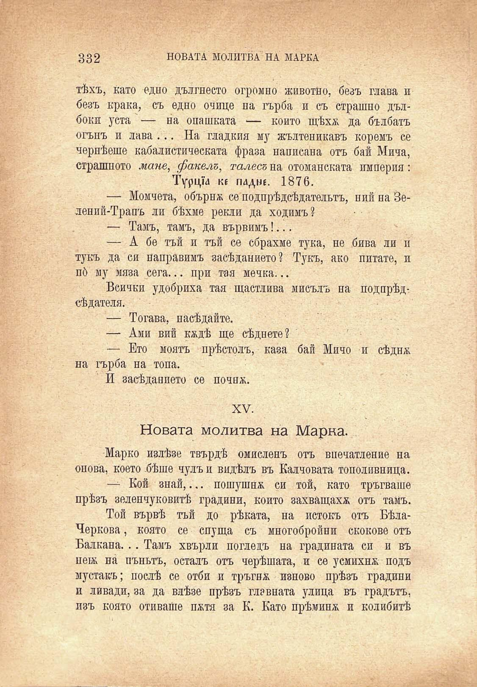

332	НОВАТА МОЛИТВА НА МАРКА

тѣхъ, като едно дългнесто огромно животно, безъ глава и безъ крака, съ едно очице на гърба и съ страшно дълбокн уста — на опашката — конто щѣхѫ да бълбатъ огънъ и лава... На гладкия му жълтеникавъ коремъ се чернѣеше кабалистическата фраза написана отъ бай Мича, страшното мане, факелъ, талесъ на отоманската империя:

Турща ке падне. 1876.

— Момчета, обърнж се подпрѣдсѣдательтъ, ний на Зелений-Трапъ ли бѣхме рекли да ходимъ?

— Тамъ, тамъ, да вървимъ!...

— А бе тъй и тъй се сбрахме тука, не бива ли п тукъ да си направимъ засѣданието? Тукъ, ако питате, и пб му мяза сега... при тая мечка...

Всички удобриха тая щастлива мисъль на подпрѣдсѣдателя.

— Тогава, насѣдайте.

— Ами вий кждѣ ще сѣднете?

— Ето моятъ прѣстолъ, каза бай Мичо и сѣднж на гърба на топа.

И засѣданието се почнж.

XV.

Новата молитва на Марка.

Марко излѣзе твърдѣ омисленъ отъ впечатление на онова, което бѣше чулъ и видѣлъ въ Калчовата тополивница.

— Кой знай,... пошушнж си той) като тръгваше прѣзъ зеленчуковитѣ градини, който захва́щахж отъ тамъ.

Той вървѣ тъй до рѣката, на истокъ отъ БѣлаЧеркова , която се спуща съ многобройни скокове отъ Балкана... Тамъ хвърли погледъ на градината си и въ пещ на пънътъ, осталъ отъ черѣшата, и се усмихнж подъ мустакъ; послѣ се отби и тръгнж наново прѣзъ градини и ливади, за да влѣзе прѣзъ главната улица въ градътъ, изъ която отиваше пжтя за К. Като прѣминж и колибитѣ

