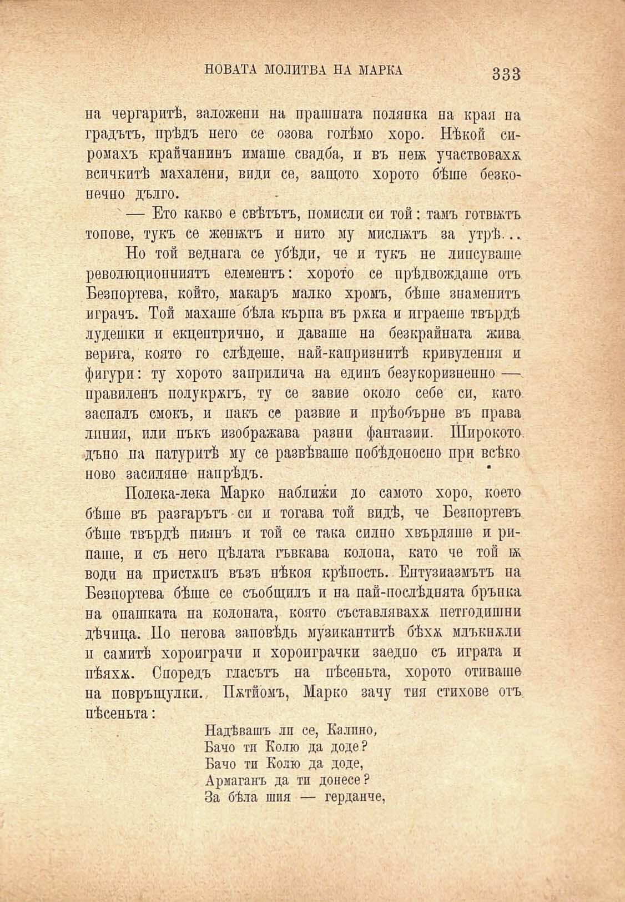

НОВАТА МОЛИТВА НА МАРКА

333

на чергаритѣ, заложени на прашната полянка на края па градътъ, прѣдъ него се озова голѣмо хоро. Нѣкой сиромахъ крайчанинъ имаше свадба, и въ неѭ участвовахж всичкитѣ махалени, види се, защото хорото бѣше безконечно дълго.

' — Ето какво е свѣтътъ, помисли си той: тамъ готвятъ топове, тукъ се женатъ и нито му мислятъ за утрѣ...

Но той веднага се убѣди, че и тукъ не липсуваше революционниятъ елементъ: хорото се прѣдвождаше отъ Безпортева, който, макаръ малко хромъ, бѣше знаменитъ играчъ. Той махаше бѣла кърпа въ ржка и играеше твърдѣ лудешки и екцептрично, и даваше на безкрайната жива верига, която го слѣдете, най-капризнитѣ принудения и фигури: ту хорото заприлича на единъ безукоризнено — правиленъ полукрѫгъ, ту се завие около себе си, като заспалъ смокъ, и пакъ се развие и прѣобърне въ права линия, пли пъкъ изображава разни фантазии. Широкото, дъно па натуритѣ му се разпѣваше побѣдоноспо при всѣко ново засиляне напрѣдъ.

Полека-лека Марко наближи до самото хоро, което бѣше въ разгарътъ си и тогава той видѣ, че Безпортевъ бѣше твърдѣ пиянъ и той се така силно хвърляше и рипаше, и съ него цѣлата гъвкава колона, като че той бк. води на пристѫпъ възъ нѣкоя крѣпость. Ентузиазмътъ па Безпортева бѣше се съобщилъ и на пай-послѣднята брънка на опашката на колоната, която съставляваха; петгодишни дѣчица. По негова заповѣдь музикантитѣ бѣхѫ млъкнжли и самитѣ хороиграчи и хороиграчки заедно съ играта и пѣяхж. Споредъ гласътъ на пѣсеньта, хорото отиваше на повръщулки... Пжтйомъ, Марко зачу тия стихове отъ пѣсеньта:

Надѣвашъ ли се, Калино, Бачо ти Колю да доде? Бачо тп Колю да доде, Армаганъ да тп донесе? За бѣла шия — герданче,

