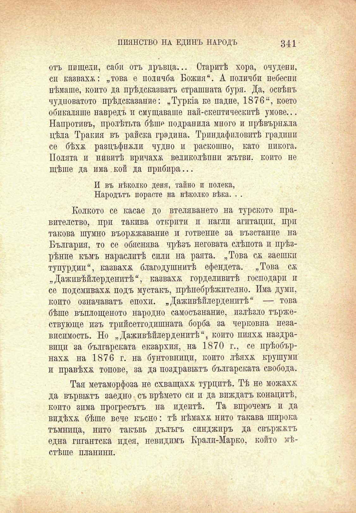

ПИЯНСТВО НА ЕДИНЪ НАРОДЪ

341

отъ пищели, саби отъ дръвца... Старитѣ хора, очудени, сп казваха: „това е поличба Божия“. А поличби небесни нѣмаше, който да прѣдсказватъ страшната буря. Да, освѣнъ чудноватото прѣдсказание: „Туркіа ке падне, 1876“, което обикаляше навредъ и смущаваше най-скептическитѣ умове... Напротивъ, пролѣтьта бѣше подранила много и прѣвърнжла цѣла Тракия въ райска градина. Триндафнловитѣ градини се бѣхѫ разцъфнжли чудно и раскошно, като никога. Нолята и нивитѣ вричахж великолѣпни жътви, който не щѣше да има . кой да прибира...

И въ нѣколко деня, тайно и полека, Народътъ порасте на нѣколко вѣка. . .

Колкото се касае до втеляването на турското правителство, при такива открити и нагли агитации, при такова шумно въоржжавание и готвенпе за възстание на България, то се обяснява чрѣзъ неговата слѣпота и прѣзрѣнпе къмъ нараслитѣ сили на раята. „Това сѫ заешкп тупурдии“, казвахж благодушнитѣ ефендета. „Това сж „Даживѣйлерденптѣ“, казвахж горделивитѣ господари п се подсмивахж подъ мустакъ, прѣнебрѣжително. Има думи, който означаватъ епохи. „Даживѣйлерденптѣ“ — това бѣше въплощеното народно самосъзнание, излѣзло тържествующе изъ трийсетгодишната борба за черковна независимость. Но „Даживѣйлерденптѣ“, който пияхж наздравици за българската екзархия, на 1870 г., се прѣобърнахж на 1876 г. на бунтовници, който лѣяхж крушуми и правѣхѫ топове, за да поздравътъ българската свобода.

Тая метаморфоза не схващахж турцитѣ. Тѣ не можахж да вървътъ заедно съ врѣмето си и да виждатъ конацитѣ, който зима прогресътъ на идеитѣ. Та впрочемъ и да видѣхѫ бѣше вече късно: тѣ нѣмахж нито такава широка тъмница, нпто такъвъ дълъгъ синджиръ да свържжтъ една гигантска пдея, невпдимъ Крали-Марко, който мѣстѣше планини.

