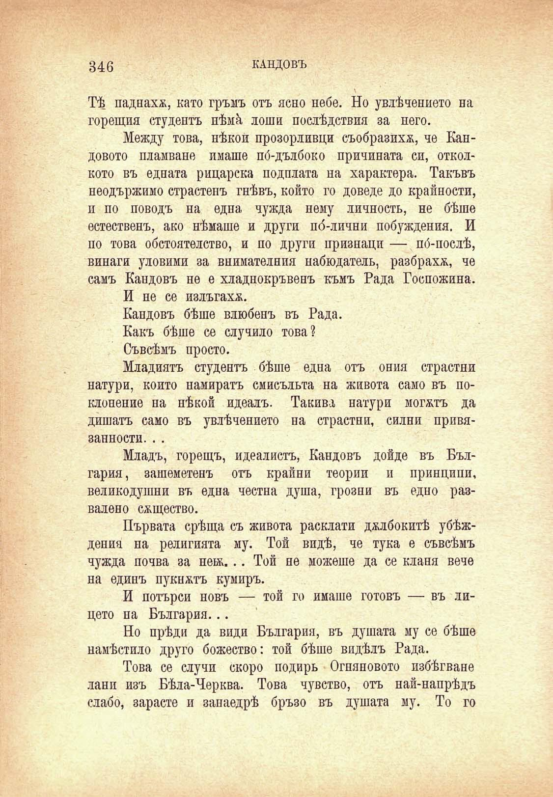

346

КАНДОВЪ

ТѢ паднаха, като гръмъ отъ ясно небе. Но увлѣчението на горещия студентъ нѣмѝ лоши послѣдствия за него.

Между това, нѣкои прозорливи# съобразиха, че Еандовото пламване имаше по́-дълбоко причината си, отколкото въ едната рицарска подплата на характера. Такъвъ неодържимо страстенъ гнѣвъ, който го доведе до крайности, и по поводъ на една чужда нему личность, не бѣше естественъ, ако нѣмаше и други по́-лични побуждения. И по това обстоятелство, и по други признаци — по́-послѣ, винаги уловими за внимателния набюдатель, разбраха, че самъ Кандовъ не е хладнокръвенъ къмъ Рада Госпожина.

И не се излъгахъ.

Кандовъ бѣше влюбенъ въ Рада.

Какъ бѣше се случило това?

Съвсѣмъ просто.

Младиятъ студентъ бѣше една отъ ония страстни натури, който намиратъ смисъльта на живота само въ поклонение на нѣкой идеалъ. Такива натури могатъ да дишатъ само въ увлѣчението на страстни, силни привязанности. . .

Младъ, горещъ, идеалистъ, Кандовъ дойде въ България, зашеметенъ отъ крайни теории и принципи, великодушни въ една честна душа, грозни въ едно развалено сѫщество.

Първата срѣща съ живота расклати дълбокитѣ убѣждения на религията му. Той видѣ, че тука е съвсѣмъ чужда почва за не®... Той не можеше да се кланя вече на единъ пукнатъ кумиръ.

И потърси новъ — той го имаше готовъ — въ лицето на България...

Но прѣди да види България, въ душата му се бѣше намѣстило друго божество: той бѣше видѣлъ Рада.

Това се случи скоро подиръ Огняновото избѣгване ланп изъ Бѣла-Черква. Това чувство, отъ най-напрѣдъ слабо, зарасте и занаедрѣ бръзо въ душата му. То го

