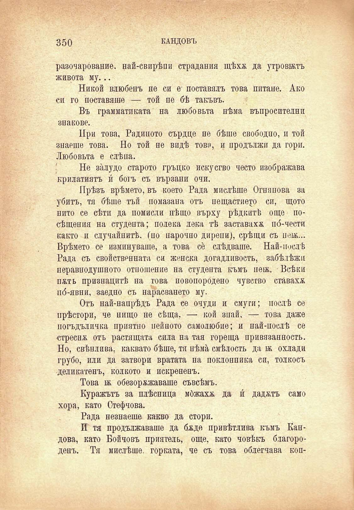

350

КАНДОВЪ

разочарование, най-свирѣпи страдания щѣхѫ да утровюъ живота му...

Никой влюбенъ не си е- поставялъ това питане. Ако си го поставяше — той пе бѣ такъвъ.

Въ грамматиката на любовьта нѣма въпросителни знакове.

При това, Радиното сърдце не бѣше свободно, и той знаеше това. Но той не видѣ това, и продължи да гори. Любовьта е слѣна.

Не залудо старото гръцко искусгво често изображава крилатиятъ и́ богъ съ вързани очи.

Прѣзъ врѣмето, въ което Рада мислѣше Огнянова за убитъ, тя бѣше тъй помазана отъ нещастието си, щото пито се сѣти да помисли нѣщо върху рѣдкитѣ още посѣщения на студента; полека лека тѣ заставаха по́-чести както и случайнитѣ, (по нарочно дирени), срѣщи съ пеьк... Врѣмето се изминуваше, а това се слѣдваше. Най-послѣ Рада съ свойственната си женска догадливость, забѣлѣжи неравнодушното отношение на студента къмъ цевь. Всѣки п&ть признацитѣ на това новопородено чувство ставаха по́-явни, заедно съ нарасването му.

Отъ най-напрѣдъ Рада се очуди и смуги; послѣ се прѣстори, че нищо не сѣща, — кой знай, — това даже погъдъличка приятно нейното самолюбие; и най-послѣ се стреснж отъ растящата сила на тая гореща нривязанность. Но, свѣнлива, каквато бѣше, тя нѣма смѣлость да а охлади грубо, или да затвори вратата на поклонника си, толкосъ деликатенъ, колкото и искрененъ.

Това ж обезорѫжаваше съвсѣмъ.

Куражътъ за плѣсница мбжахя да и́ дадатъ само хора, като Стефчова.

Рада незнаеше какво да стори.

И тя продължаваше да бѫде привѣтлива къмъ Кандова, като Бойновъ приятель, още, като човѣкъ благороденъ. Тя мислѣше, горката, че съ това облегчава коп

