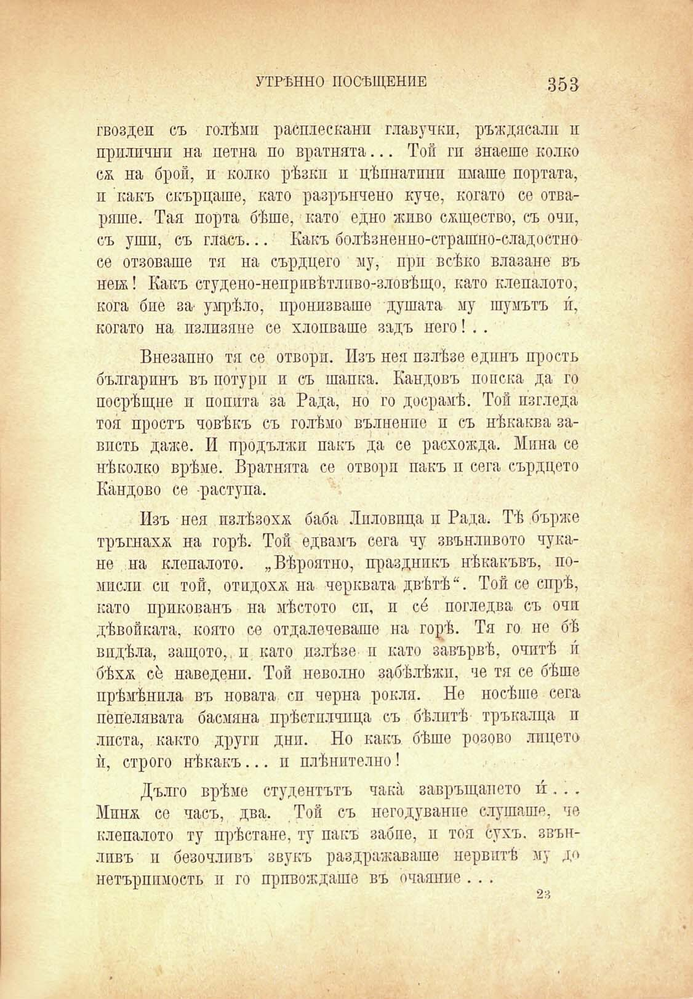

УТРѢННО ПОСѢЩЕНИЕ

353

гвоздеи съ голѣми расплесканп главучкп, ръждясали п прилични на петна по вратнята... Той ги знаеше колко сж на брой, и колко рѣзки и цѣпнатпнп имаше портата, п какъ скърцаше, като разрънчено куче, когато се отваряше. Тая порта бѣше, като едно живо сѫщество, съ очи, съ уши, съ гласъ... Какъ болѣзненно-страшно-сладостно се отзоваше тя на сърдцего му, при всѣко влизане въ нетж! Какъ студено-непривѣтлпво-зловѣщо, като клепалото, кога бие за- умрѣло, пронизваше душата му шумътъ и, когато на излизане се хлопваше задъ него! . .

Внезапно тя се отвори. Изъ нея излѣзе единъ простъ българинъ въ потури и съ шапка. Кандовъ поиска да го посрѣщне и попита за Рада, но го досрамѣ. Той изгледа тоя простъ човѣкъ съ голѣмо вълнение и съ нѣкаква завлсть даже. И продължи пакч> да се расхожда. Мина се нѣколко врѣме. Вратнята се отвори пакъ и сега сърдцето Кандово се раступа.

Изъ нея излѣзоха; баба Лпловпца и Рада. Тѣ бърже тръгнаха на горѣ. Той едвамъ сега чу звънливото чукане на клепалото. „Вѣроятно, праздппкъ нѣкакъвъ, помпслп си той, отидоха; на черквата двѣтѣ“. Той се спрѣ, като прикованъ на мѣстото сп, и се погледна съ очи дѣвойката, която се отдалечеваше на горѣ. Тя го не бѣ впдѣла, защото,, и като излѣзе и като завървѣ, очитѣ и бѣхѫ се наведешъ Той неволно забѣлѣжи, че тя се бѣше прѣмѣняла въ новата си черна рокля. Не носѣше сега пепелявата басмяна прѣстилчица съ бѣлитѣ тръкилца п листа, както други дни. Но какъ бѣше розово лицето ѝ, строго нѣкакъ... и плѣнително !

Дълго врѣме студентътъ чака завръщането и́. . . Минж се часъ, два. Той съ негодувание слушаше, че клепалото ту прѣстане, ту пакъ забие, и тоя сухъ, звъилпвъ и безочливъ звукъ раздражаваше нервитѣ му д<» нетърпимость и го привеждаше въ очаяиие . . .

