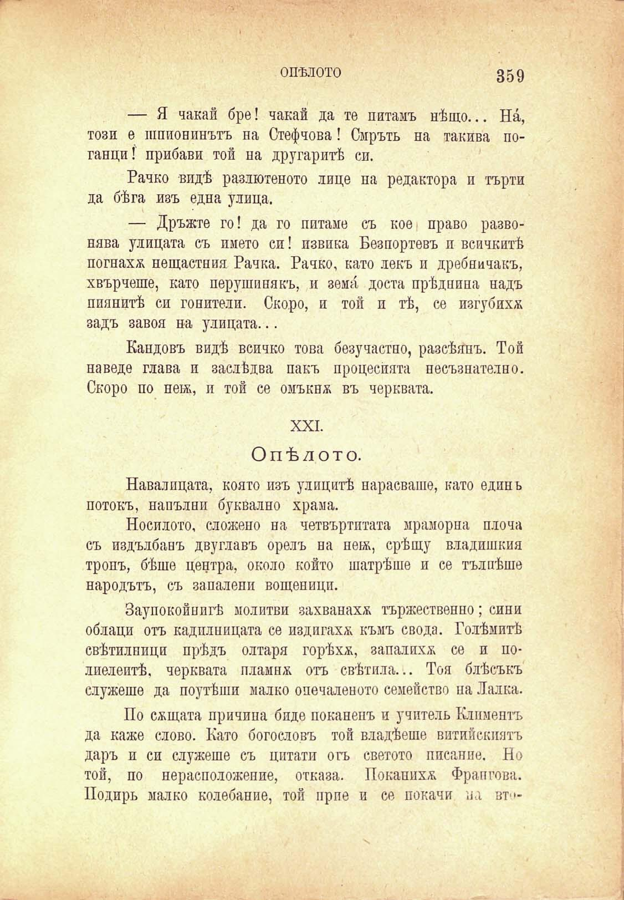

ОПѢЛОТО

359

— Я чакай бре! чакай да те питамъ нѣщо... На́, този е шпионинътъ на Стефчова! Смръть на такива поганци! прибави той на другаритѣ си.

Рачко видѣ разлютеното лице на редактора и търти да бѣга изъ една улица.

— Дръжте го! да го питаме съ кое право развонява улицата съ името си! извика Безпортевъ и всичкитѣ погнаха нещастния Рачка. Рачко, като лекъ и дребничакъ, хвърчеше, като перушинакъ, и земя доста прѣдпипа надъ пиянитѣ си гонители. Скоро, и той и тѣ, се изгубиха задъ завоя на улицата...

Кандовъ видѣ всичко това безучастно, разсѣянъ. Той наведе глава и заслѣдва пакъ процесията несъзнателно. Скоро по новъ, и той се омъкнж въ черквата.

XXI.

Опѣдото.

Навалицата, която изъ улицитѣ парясваше, като единъ потокъ, напълни буквално храма.

Носилото, сложено на четвъртитата мраморна плоча съ издълбанъ двуглавъ орелъ на неж, срѣщу владишкия тропъ, бѣше центра, около който шатрѣше и се тълпѣше народътъ, съ запалени вощеници.

Заупокойнитѣ молитви захванаха тържественно; сини облаци отъ кадилницата се издигаха къмъ свода. Голѣмитѣ свѣтилници прѣдъ олтаря горѣха, запалихѫ се и полиелеитѣ, черквата пламна отъ свѣтила... Тоя блѣсъкъ служеше да поутѣши малко опечаленото семейство на Лалка.

По сжщата причина биде поканенъ и учитель Климента да каже слово. Като богословъ той владѣеше питийскиятъ даръ и си служеше съ цптати отъ светото писание. Но той, по нерасположение, отказа. Понапихѫ Франгова. Подиръ малко колебание, той прие и се покачи на вт"

