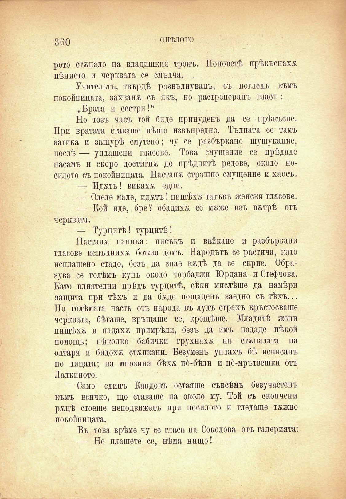

зво

ОПѢЛОТО

рото стжпало на владишкия тронъ. Поповетѣ прѣкъснахж пѣнпето и черквата се смълча.

Учительтъ, твърдѣ развълнуванъ, съ погледъ къмъ покойницата, захвана съ якъ, но растреперанъ гласъ:

„Братя и сестри!“

Но тозъ часъ той биде принуденъ да се прѣкъсне. При вратата ставаше нѣщо извънредно. Тълпата се тамъ затика и защурѣ смутено; чу се разбъркано шушукапие, послѣ — уплашени гласове. Това смущение се прѣдаде насамъ и скоро достигна до прѣднитѣ редове, около носилото съ покойницата. Настанж страшно смущение и хаосъ.

— Иджтъ! викахж едни.

— Олеле мале, иджтъ! пищѣхѫ татъкъ женски гласове.

— Кой иде, бре? обадихѫ се мжже изъ вжтрѣ отъ черквата.

— Турцитѣ! турцитѣ!

Настана паника: писъкъ и вайкане и разбъркани гласове попълнихѫ божия домъ. Народътъ се растича, като неплатено стадо, безъ да знае кждѣ да се скрие. Образува се голѣмъ купъ около чорбаджи Юрдана и Стефчова. Като влиятелни прѣдъ турцитѣ, сѣки мислѣше да намѣри защита при тѣхъ и да бѫде пощаденъ заедно съ тѣхъ... Но голѣмата часть отъ народа въ лудъ страхъ кръстосваше черквата, бѣгаше, връщаше се, крещѣше. Младитѣ жени пищѣхѫ и падахж примрѣли, безъ да имъ подаде нѣкой помощь; нѣколко бабички грухнахж на стжпалата на олтара и бидохж стжпкапи. Безуменъ уплахъ бѣ неписанъ по лицата; на мнозина бѣхѫ по́-бѣли и по́-мрътвешки отъ Лалкиното.

Само единъ Кандовъ оетаяше съвсѣмъ безучастенъ къмъ всичко, що ставаше на около му. Той съ скопчени ржцѣ стоеше неподвижелъ при носилото и гледаше тжжно покойницата.

Въ това врѣме чу се гласа па Соколова отъ галерпята:

— Не плашете се, нѣма нпщо!

