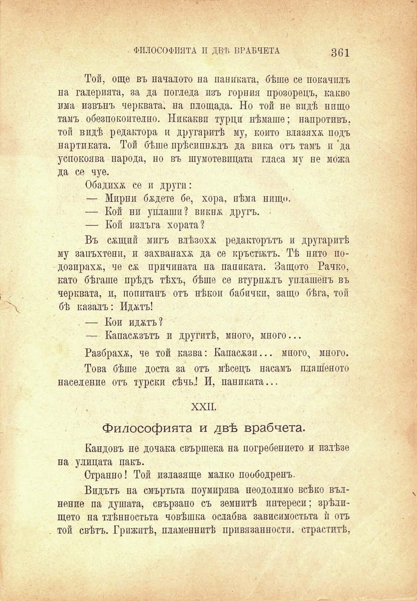

. ФИЛОСОФИЯТА II ДВ1» ВРАБЧЕТА

361

Той, още въ началото на паниката, бѣше се покачилъ на галерията, за да погледа изъ горния прозорецъ, какво пма извънъ черквата, на площада. Но той не видѣ нищо тамъ обезпокоително. Никакви турци нѣмаше; напротивъ, той видѣ редактора и другаритѣ му, който влазяхж подъ нартиката. Той бѣше прѣсипналъ да вика отъ тамъ и 'да успокоява народа, но въ шумотевицата гласа му не можа да се чуе.

Обадихѫ се и други:

— Мирни бедете бе, хора, нѣма нишо.

— Кой ни уплаши? викна; другъ.

— Кой излъга хората?

Въ сжщий мигъ влѣзохѫ редакторътъ и другаритѣ му запъхтени, и захванаха да се кръстатъ. Тѣ нито подозирахж, че сѫ причината на паниката. Защото Рачко, като бѣгаше прѣдъ тѣхъ, бѣше се втурналъ уплашенъ въ черквата, и, попитанъ отъ нѣкои бабички, защо бѣга, той бѣ казалъ: Иджтъ!

— Кои иджтъ?

— Капасжзътъ и другитѣ, много, много...

Разбрахж, че той казва: Капасжзи... много^ много.

Това бѣше доста за отъ мѣсецъ насамъ платеното население отъ турски сѣчь.! И, паниката...

XXII.

Философията и двѣ врабчета.

Кандовъ не дочака свършека на погребението и излѣзе на улицата пакъ.

Странно! Той излазяще малко поободренъ.

Видътъ на смъртьта поумирява неодолимо всѣко вълнение па душата, свързано съ земнитѣ интереси; зрѣлището на тленностьта човѣшка ослабва зависимостьта й отъ той свѣтъ. Грижитѣ, пламеннитѣ привязанности. страститѣ,

