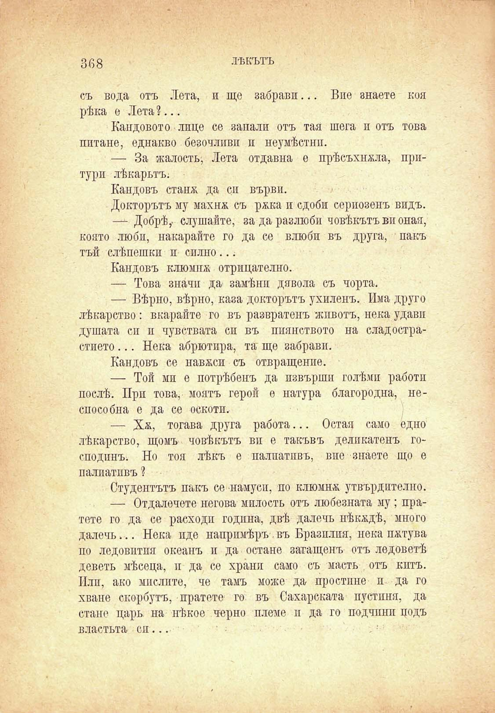

368

ЛѢКЪТЪ

съ вода отъ Лета, и ще забрави... Вие знаете коя рѣка е Лета?...

Каидовото лице се запали отъ тая шега и отъ това питане, еднакво безочливи и неумѣстни.

— За жалость, Лета отдавна е прѣсъхвала, притури лѣкарьтъ.

Кандовъ стапя. да си върви.

Докторътъ му махнж съ ржка и сдоби сериозенъ видъ.

—- Добрѣ,- слушайте, за да разлюби човѣкътъ ви оная, конто люби, накарайте го да се влюби въ друга, пакъ тъй слѣпешкн и силно...

Кандовъ клюмна отрицателно.

— Това значи да замѣни дявола съ чорта.

— Вѣрно, вѣрно, каза докторътъ ухиленъ. Има друго лѣкарство: вкарайте го въ развратенъ животъ, нека удави душата си и чувствата си въ пиянството на сладострастието... Нека абрютира, та ще забрави.

Кандовъ се навеси съ отвращение.

— Той мп е потрѣбенъ да извърши голѣми работи послѣ. При това, моятъ герой е натура благородна, неспособна е да се оскотп.

— Ха, тогава друга работа... Остая само едно лѣкарство, щомъ човѣкътъ ви е такъвъ деликатенъ господинъ. Но тоя лѣкъ е палпатпвъ, вие знаете що е палиатпвъ ?

Студентътъ пакъ се намуси, по клюмна утвърдително.

— Отдалечете негова милость отъ любезната му; пратете го да се расходп година, двѣ далечъ нѢкадѢ, много далечъ... Нека иде напримѣръ. въ Бразилия, нека пжтува по ледовития океанъ и да остане загащенъ отъ ледоветѣ деветь мѣсеца, и да се храни само съ масть отъ китъ. Или, ако мислите, че тамъ може да простине и да го хване скорбутъ, пратете го въ Сахарската пустиня, да стане царь на нѣкое черно племе и да го подчини подъ

властьта сп...

