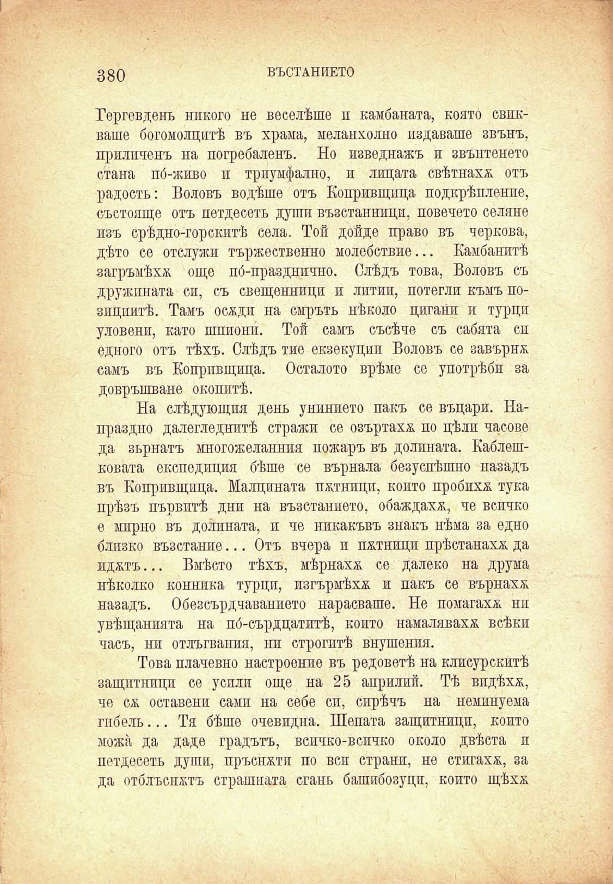

380

ВЪСТАНИЕТО

Гергевдень никого не веселѣше и камбаната, която свпкваше богомолцитѣ въ храма, меланхолно издаваше звънъ, приличенъ на погребаленъ. Но изведнажъ и звънтенето стана по́-живо и триумфално, и лицата свѣтнаха отъ радость: Воловъ водѣше отъ Копривщица подкрѣпление, състояще отъ петдесеть души възстанници, повечето селяне изъ срѣдно-горскитѣ села. Той дойде право въ чернова, дѣто се отслужи тържественно молебствие... Камбанитѣ загръмѣхѫ още по́-празднпчно. Слѣдъ това, Воловъ съ дружината сп, съ свещенници и литии, потегли къмъ позицпитѣ. Тамъ осжди на смръть нѣколо цигани и турци уловени, като шпиони. Той самъ съсѣче съ сабята сп едното отъ тѣхъ. Слѣдъ тие екзекуции Воловъ се завърнж самъ въ Копривщица. Осталото врѣме се употрѣби за довръшване окопитѣ.

На слѣдующпя день унинието пакъ се въцари. Напраздно далегледнитѣ стражи се озъртаха по цѣлп часове да зърнатъ многожеланий пожаръ въ долината. Каблешковата експедиция бѣше се върнала безуспѣшно назадъ въ Копривщица. Малцината потници, копто пробихѫ тука прѣзъ първитѣ дни на възстанието, обаждаха, че всичко е мирно въ долината, и че никакъвъ знакъ нѣма за едно близко възстание... Отъ вчера и пжтници прѣстанаха да иджтъ... Вмѣсто тѣхъ, мѣрнахж се далеко на друма нѣколко конника турци, изгърмѣха и пакъ се върнаха; назадъ. Обезсърдчаванието нарасваше. Не помагаха нп увѣщанията на по́-сърдцатитѣ, който намаляваха всѣки часъ, ни отлъгвания, ни строгитѣ внушения.

Това плачевно настроение въ редоветѣ на клисурскитѣ защитници се усили още на 25 априлип. Тѣ впдѣхж, че сѫ оставенп сами на себе сп, сирѣчъ на неминуема гибель... Тя бѣше очевидна. Шепата защитници, който можа да даде градътъ, вспчко-вспчко около двѣста п петдесеть души, пръснжтп по вси страни, не стигахж, за да отблъснжтъ страшната сгань башибозуци, който щѣхж

