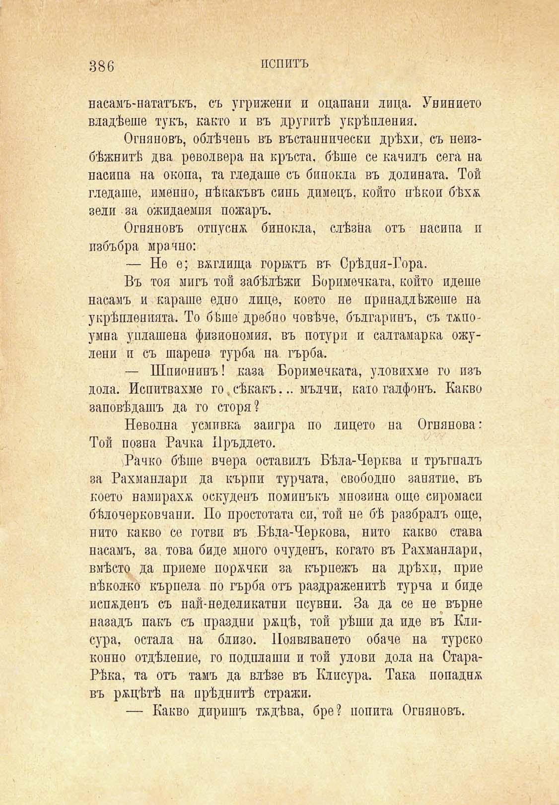

386

пепитъ

насамъ-нататъкъ, съ угрижени и оцапани лица. Унинието владѣеше тукъ, както и въ другитѣ укрѣпления.

Огняновъ, облѣченъ въ въстаинически дрѣхи, съ неизбѣжнитѣ два револвера па кръста, бѣше се качилъ сега на насипа на окопа, та гледаше съ бипокла въ долината. Той гледаше, именно, нѣкакъвъ синь димецъ, който нѣкои бѣхж зели за ожидаемпя пожаръ.

Огняновъ отпусня бинокла, слѣзѝа отъ насипа п пзбъбра мрачно:

— Не е; вжглища горятъ въ Срѣдня-Гора.

Въ тоя мигъ той забѣлѣжи Боримечката, който идеше насамъ и караше едно лице, което не принадлѣжеше на укрѣпленията. То бѣше дребно човѣче, българинъ, съ тѫпоумна уплашена физиономия, въ петури и салтамарка ожулени и съ шарена турба па гърба.

— Шпионинъ! каза Боримечката, уловихме го изъ дола. Испитвахме го,сѣкакъ... мълчи, като галфонъ. Какво заповѣдашъ да го сторя?

Неволна усмивка заигра по лицето на Огнянова: Той позна Рачка Пръдлето.

Рачко бѣше вчера оставилъ Бѣла-Черква и тръгналъ за Рахмаплари да кърпи турната, свободно занятие, въ което намираха оскудепъ поминъкъ мнозина още сиромаси бѣлочерковчани. По простотата си, той не бѣ разбралъ още, нито какво се готви въ Бѣла-Черкова, нито какво става насамъ, за. това биде много очуденъ, когато въ Рахманлари, вмѣсто да приеме поржчки за кърпежъ на дрѣхи, прие нѣколко кърпела по гърба отъ раздраженитѣ турча и биде испждепъ съ най-неделикатни псувни. За да се не върне назадъ пакъ съ праздни ржцѣ, той рѣши да иде въ Клисура, остала на близо. Появяването обаче на турско конно отдѣление, го подплаши и той улови дола на СтараРѣка, та отъ тамъ да влѣзе въ Клисура. Така попадия въ ряцѣтѣ на прѣдцитѣ стражи.

— Какво диришъ тждѣва, бре? попита Огняновъ.

