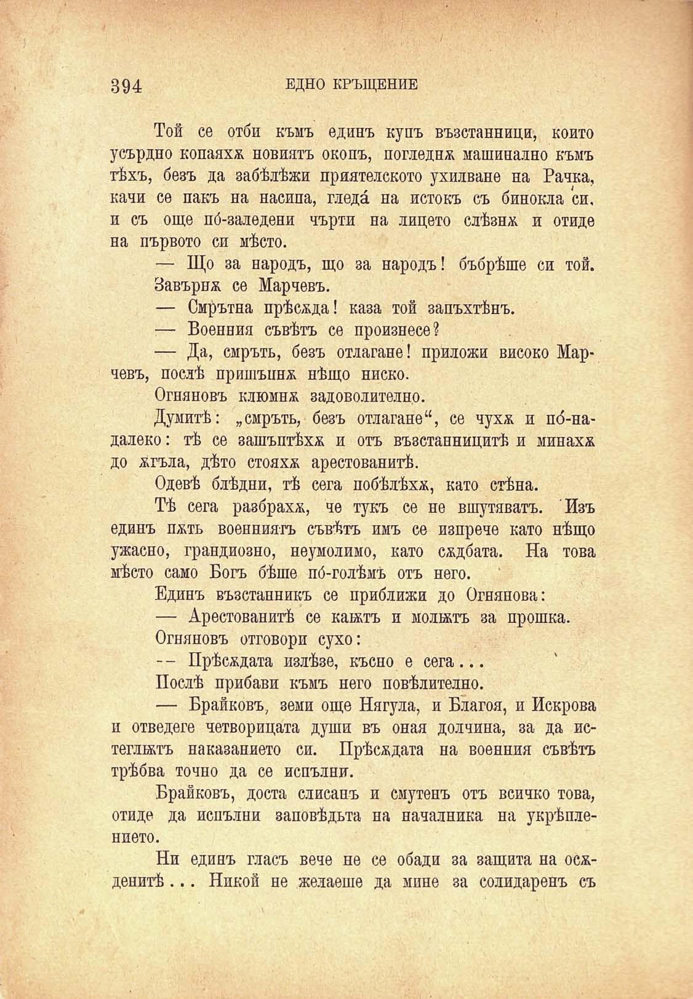

394

ЕДНО КРЪЩЕНИЕ

Той се отби къмъ единъ купъ възстанници, който усърдно копаяхж новиятъ окопъ, погледна машинално къмъ тѣхъ, безъ да забѣлѣжи приятелското ухилване на Рачка, качи се пакъ на насипа, гледа на истокъ съ бинокла си, и съ още по́-заледени чърти на лицето слѣзнж и отиде на първото си мѣсто.

— Що за народъ, що за народъ! бъбрѣше си той.

Завърна се Марчевъ.

— Смрътна прѣсѣда! каза той запъхтѣнъ.

— Военния съвѣтъ се произнесе?

— Да, смръть, безъ отлагане! приложи високо Марчевъ, послѣ пришъпнж нѣщо ниско.

Огняновъ клюмна задоволително.

Думитѣ: „смръть, безъ отлагане“, се чухк и по́-надалеко: тѣ се зашъптѣхѫ и отъ възстанницитѣ и минаха до жгъла, дѣто стояха арестованитѣ.

Одевѣ блѣдни, тѣ сега побѣлѣха, като стѣна.

Тѣ сега разбраха, че тукъ се не вшутяватъ. Изъ единъ патъ военниятъ съвѣтъ имъ се изпрече като нѣщо ужасно, грандиозно, неумолимо, като садбата. На това мѣсто само Богъ бѣше по́-голѣмъ отъ него.

Единъ възстапникъ се приближи до Огнянова:

— Арестованитѣ се катъ и моятъ за прошка.

Огняновъ отговори сухо:

- - Прѣсадата излѣзе, късно е сега...

Послѣ прибави къмъ него повѣлително.

— Брайковъ, земи още Нягула, и Благой, и Искрова и отведете четворицата души въ оная долчина, за да истеглжтъ наказанието си. Прѣсждата на военния съвѣтъ трѣбва точно да се непълни.

Брайковъ, доста слисанъ и смутенъ отъ всичко това, отиде да непълни заповѣдьта на началника на укрѣплението.

Ни единъ гласъ вече не се обади за защита на осѫденитѣ ... Никой не желаеше да мине за солидаренъ съ

