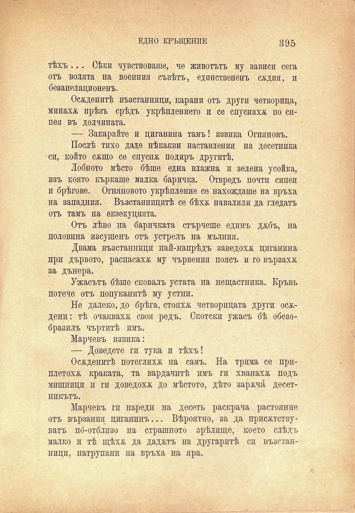

ЕДНО КРЪЩЕНИЕ	395

тѣхъ ... Сѣки чувствоваше, че животътъ му зависи сега отъ волята на военния съвѣтъ, единствененъ сждия, и безапелационенъ.

Осѫденитѣ възстанници, карани отъ други четворица, минахж прѣзъ срѣдъ укрѣплението и се спуснаха по сипея въ долчината.

— Закарайте и циганина тамъ! извика Огняновъ.

Послѣ тихо даде нѣкакви наставления на десетника си, който сжщо се спуснж подиръ другитѣ.

Лобното мѣсто бѣше една влажна и зелена усойна, изъ която къркаше малка баричка. Отвредъ почти сипеи и брѣгове. Огняновото укрѣпление се нахождаше на връха на западния. Възстанницитѣ се бѣхѫ наваляли да гледатъ отъ тамъ на екзекуцията.

Отъ лѣво на баричката стърчеше едпнъ джбъ, на половина изсушенъ отъ устрелъ на мълния.

Двама възстанници най-напрѣдъ заведохж циганина при дървото, распасахж му чървения поясъ и го вързахж за дънера.

Ужасътъ бѣше сковалъ устата на нещастника. Кръвь потече отъ попуканитѣ му устни.

Не далеко, до брѣга, стояхж четворицата други осждени: тѣ очаквахж своя редъ. Скотски ужасъ бѣ обезобразилъ чъртитѣ имъ.

Марчевъ извика:

— Доведете ги тука и тѣхъ!

Осжденитѣ потеглихж на самъ. На трима се приплетохж краката, та вардачитѣ имъ ги хванахж подъ мишници и ги доведохж до мѣстото, дѣто заржчй, десетникътъ.

Марчевъ ги нареди на десеть раскрача растоянпе отъ Бързания циганинъ... Вѣроятно, за да присжтствуватъ по́-отблпзо на страшното зрѣлшце, което слѣдъ малко и тѣ щѣхѫ да даджтъ на другаритѣ си възстанници, натрупани на връха на яра.

