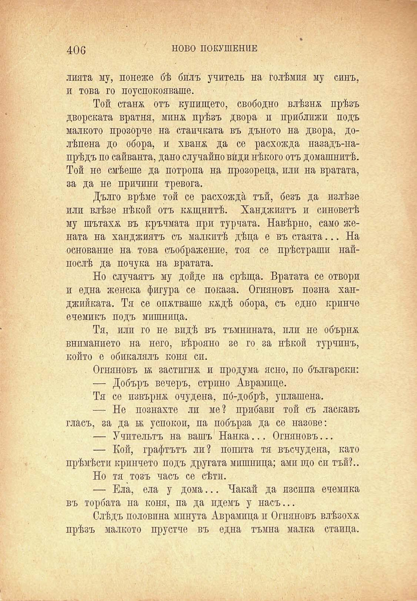

406

НОВО ПОКУШЕНИЕ

лията му, понеже бѣ билъ учитель на голѣмия му синъ, и това го поуспокояваше.

Той станж отъ купището, свободно влѣзнж прѣзъ дворската вратня, минж прѣзъ двора и приближи подъ малкото прозорче на стаичката въ дъното на двора, долѣпена до обора, и хванж да се расхожда назадъ-напрѣдъ по сайванта, дано случайно види нѣкого отъ домашнитѣ. Той не смѣеше да потропа на прозореца, или на вратата, за да не причини тревога.

Дълго врѣме той се расхожда тъй, безъ да излѣзе или влѣзе нѣкой отъ кжщнитѣ. Ханджиятъ и синоветѣ му шътахж въ кръчмата при турната. Навѣрно, само жената на ханджиятъ съ малкитѣ дѣца е въ стаята... На основание на това съображение, тоя се прѣстраши найпослѣ да почука на вратата.

Но случаятъ му дойде на срѣща. Вратата се отвори и една женска фигура се показа. Огняновъ позна ханджийката. Тя се опитваше кждѣ обора, съ едно крикче ечемикъ подъ мишница.

Тя, или го не видѣ въ тъмнината, или не обърнж вниманието на него, вѣрояно зе го за нѣкой турчинъ, който е обикалялъ коня си.

Огняновъ бк застигнж и продума ясно, по български:

— Добъръ вечеръ, стрино Аврамице.

Тя се пзвърнж очудена, по́-добрѣ, уплашена.

— Не познахте ли ме? прибави той съ ласкавъ гласъ, за да бк успокои, па побърза да се назове:

— Учительтъ на вашъ Нанка... Огняновъ...

— Кой, графтътъ ли? попита тя въсчудена, като прѣмѣсти кринчето подъ другата мишница; ами що си тъй?..

Но тя тозъ часъ се сѣти.

— Ела, ела у дома... Чакай да изсипа ечемика въ торбата на коня, па да идемъ у насъ...

Слѣдъ половина минута Аврамица и Огняновъ влѣзохж прѣзъ малкото прустче въ една тъмна малка стаица.

