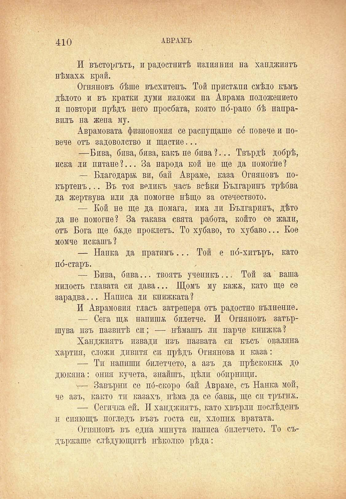

нѣмаха край.

Огняновъ бѣше въсхитепъ. Той пристѫпи слѣдо къмъ дѣлото и въ кратки думи изложи на, Аврама положението и повтори прѣдъ него просбата, която по́-рано бѣ направилъ на жена му.

Аврамовата физиономия се распущаше се повече и повече отъ задоволство и щастие...

—Бива, бива, бива, какъ пе бива ?... Твърдѣ добрѣ, иска ли питане?... За народа кой пе ще да помогне?

— Благодари; ви, бай Авраме, каза Огняновъ покъртенъ... Въ тоя великъ часъ всѣки Българинъ трѣбва да жертвува или да помогне нѣщо за отечеството.

— Кой не ще да помага, има ли Българинъ, дѣто да не помогне? За такава свята работа, който се жали, отъ Бога ще бѫде проклетъ. То хубаво, то хубаво... Кое момче искашъ ?

— Нанка да пратимъ... Той е по́-хитъръ, като по́-старъ.

— Бива, бива... твоятъ ученикъ... Той за ваша милость главата си дава... Щомъ му кажж, като ще се зарадва... Написа ли книжната ?

И Аврамовия гласъ затрепери отъ радостно вълненпе.

— Сега щж напишж билетче. И Огняновъ затършува изъ пазвитѣ си; — нѣмашъ ли парче книжка?

Ханджиятъ извади изъ пазвата си късъ оваляна хартия, сложи дивитя си- прѣдъ Огнянова и каза:

— Ти напиши билетчето, а азъ да прѣскокна до дюкяна: ония кучета, знайшъ, цѣли обирници.

— Завърни се по́-скоро бай Авраме, съ Нанка мой, че азъ, както ти казахъ, нѣма да се бавъж, ще си тръгнж.

— Сегичка ей. И ханджиятъ, като хвърли послѣденъ и спяющъ погледъ възъ госта си, хлопнж вратата.

Огняновъ въ една минута написа билетчето. То съдържаше слѣдующптѣ нѣколко рѣда:

