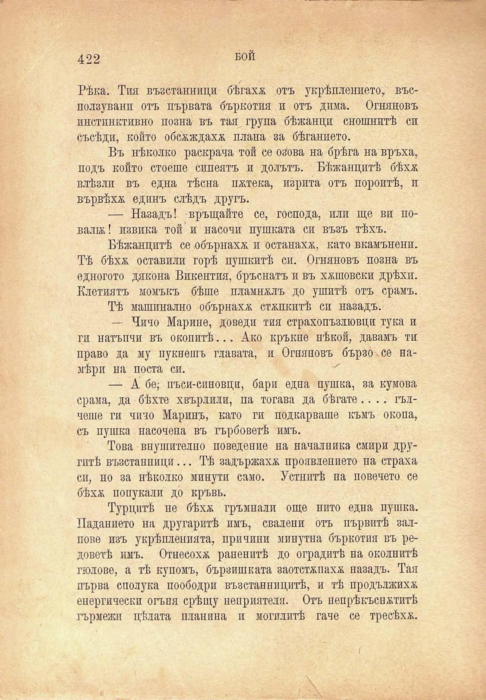

422	БОЙ

Рѣка. Тия възстанници бѣгаха отъ укрѣплението, въсползувани отъ първата бъркотия и отъ дима. Огняновъ инстинктивно позна въ тая група бѣжанци снощнитѣ си съсѣди, който обсжждахж плана за бѣганието.

Въ нѣколко раскрача той се озова на брѣга на връха, подъ който стоеше сипеятъ и долътъ. Бѣжанцитѣ бѣхж влѣзли въ една тѣсна пжтека, изрита отъ пороитѣ, и вървѣхѫ единъ слѣдъ другъ.

— Назадъ! връщайте се, господа, или ще ви повали ! извика той и насочи пушката си възъ тѣхъ.

Бѣжанцитѣ се ,обърнахж и останахж, като вкамънени. Тѣ бѣхѫ оставяли горѣ пушкитѣ си. Огняновъ позна въ едногото дякона Викентия, бръснатъ и въ хжшовски дрѣхи. Клетиятъ момъкъ бѣше пламнжлъ до ушитѣ отъ срамъ.

Тѣ машинално обърнахж стжпкитѣ си назадъ.

— Чичо Марино, доведи тия страхопъзлювци тука и ги натъпчи въ окопитѣ... Ако кръкне нѣкой, давамъ ти право да му пукнешъ главата, и Огняновъ бързо-се намѣри на поста си.

— А бе; пъси-синовци, бари една пушка, за кумова срама, да бѣхте хвърлили, па тогава да бѣгате.... гълчеше ги чичо Маринъ, като ги подкарваше къмъ окопа, съ пушка иасочена въ гърбоветѣ имъ.

Това внушително поведение на началника смири другитѣ възстанници... Тѣ задържахж проявлението на страха си, но за нѣколко минути само. Устнитѣ па повечето се бѣхѫ попукали до кръвь.

Турцитѣ пе бѣхѫ гръмвали още нито една пушка. Изданието на другаритѣ имъ, свилени отъ първитѣ залпове изъ укрѣпленията, причини минутна бъркотия въ редоветѣ имъ. Отнесохж раненитѣ до оградитѣ на околнитѣ гюлове, а тѣ купомъ, бързпшката заотстжпахж назадъ. Тая първа сполука поободри възстанницитѣ, и тѣ продължихж енергически огъня срѣщу неприятеля. Отъ непрѣкъснжтитѣ гърмежи цѣлата планина и могилитѣ гаче се тресѣхж.

