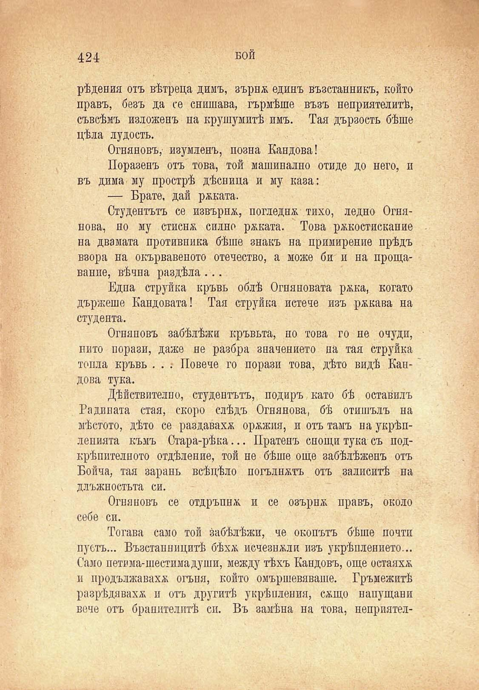

рѣдения отъ вѣтреца димъ, зърнж единъ възстанникъ, който правъ, безъ да се снишава, гърмѣше възъ неприятелитѣ, съвсѣмъ изложенъ на крушумитѣ имъ. Тая дързость бѣше цѣла лудость.

Огняновъ, изумленъ, позна Кандова!

Поразенъ отъ това, той машинално отиде до него, и въ дима му прострѣ дѣсница и му каза:

— Брате, дай ржката.

Студентътъ се извърна, погледна тихо, ледно Огнянова, но му стисна силно рѣката. Това ржкостискание на двамата противника бѣше знакъ на примирение прѣдъ взора на окървавеното отечество, а може би и на прощавание, вѣчна раздѣла ...

Една струйка кръвь облѣ Огияновата ржка, когато държеше Кандовата! Тая струйка истече изъ рѫкава на студента.

Огняновъ забѣлѣжи кръвьта, но това го не очуди, пито порази, даже не разбра значението па тая струйка топла кръвь . . : Повече го порази това, дѣто видѣ Кай- ~ дова тука.

Дѣйствителпо, студентътъ, подиръ като бѣ оставилъ Гадината стая, скоро слѣдъ Огнянова, бѣ отишълъ на мѣстото, дѣто се раздаваха орѫжия, и отъ тамъ на укрѣплепията къмъ Стара-рѣка... Пратенъ снощи тука съ подкрѣпителното отдѣление, той не бѣше още забѣлѣженъ отъ Бойча, тая зарань всѣцѣло погълнатъ отъ заливитѣ на длъжностьта си.

Огняновъ се отдръпна и се озърна правъ, около себе си.

Тогава само той забѣлѣжи, че окопътъ бѣше почти пустъ... Възстанницитѣ бѣхѫ исчезнжли изъ укрѣплението... Само петима-шестимадуши, между тѣхъ Кандовъ, още остаяхж и продължаваха огъня, който омършевяваше. Гръмежитѣ разрѣдявахж и отъ другитѣ укрѣпления, сжщо напущани вече отъ бранителитѣ си. Въ замѣна на това, неприятел

