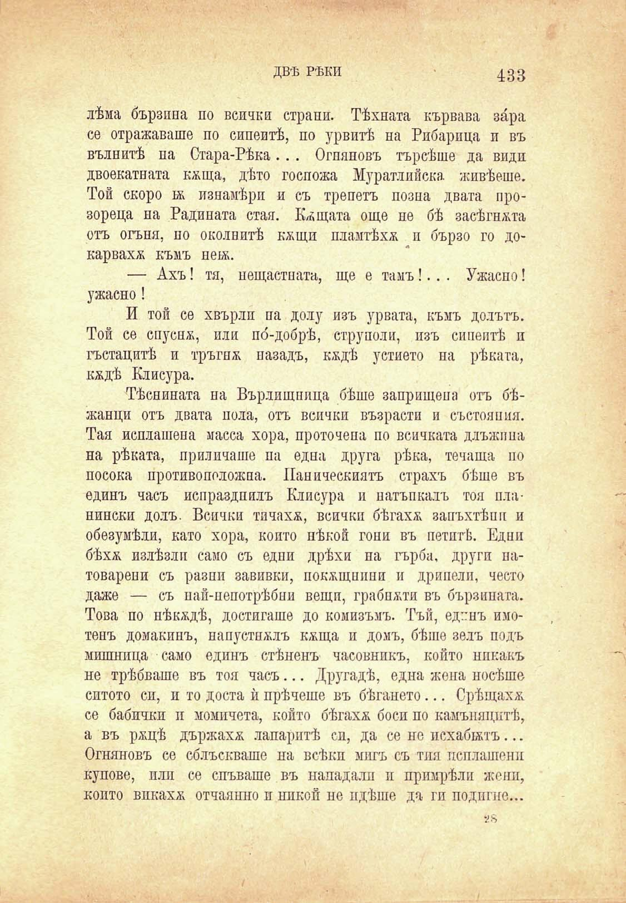

ДВѢ РѢКИ	433

лѣма бързина по всички страни. Тѣхната кървава зара се отражаваше по сипеитѣ, по урвитѣ на Рибарпца и въ вълнитѣ па Стара-Рѣка.. . Огняновъ търсѣше да види двоекатната кжща, дѣто госпожа Муратлийска. живѣеше. Той скоро бь изнамѣри и съ трепетъ позна двата прозореца на Радината стая. Кѫщата още пе бѣ заеѣгнжта отъ огъня, но околнитѣ кжщи пламтѣха и бързо го докарвахѫ къмъ пекъ.

— Ахъ! тя, нещастната, ще е тамъ!.. . Ужасно! ужасно!

И той се хвърли па долу изъ урвата, къмъ долътъ. Той се спуснж, или по́-добрѣ, етруполи, изъ сипеитѣ п гъстацитѣ и тръгнж назадъ, кждѣ устието на рѣката, кждѣ Клисура.

Тѣснината на Върдищпица бѣше заприщепа отъ бѣжанци отъ двата пола, отъ всички възрасти и състояния. Тая исплашена масса хора, проточепа по всичката длъжпна на рѣката, приличаше па една друга рѣка, течаша по посока противоположна. Паническиятъ страхъ бѣше въ единъ часъ испраздпилъ Клисура и натъкналъ тоя планински долъ. Всички тичахѫ, всички бѣгахѫ запъхтѣпп и обезумѣли, като хора, който нѣкой гони въ петитѣ. Едни бѣхѫ излѣзли само съ едни дрѣхи па гърба, други натоварени съ разпи завивки, покжщиини и дрипелп, често даже — съ пай-пепотрѣбни вещи, грабнжти въ бързината. Това по нѣкждѣ, достигаше до комизъмъ. Тъй, единъ имотенъ домакинъ, напустнжлъ кжща и домъ, бѣше зелъ подъ мишница само единъ стѣненъ часовникъ, който никакъ не трѣбваше въ тоя часъ... Другадѣ, една жена носѣше ситото сп, и то доста ѝ прѣчеше въ бѣгането... Срѣщахѫ. се бабички и момичета, който бѣгахѫ боси по камънацитѣ, а въ ржцѣ държахѫ лапаритѣ сп, да се но исхабтжтъ... Огняновъ се сблъскваше на всѣки мигъ съ тия неплатени купове, или се спъваше въ нападали и примрѣли жени, който впкахѫ отчаянно и никой не идѣше да ги подигие...

