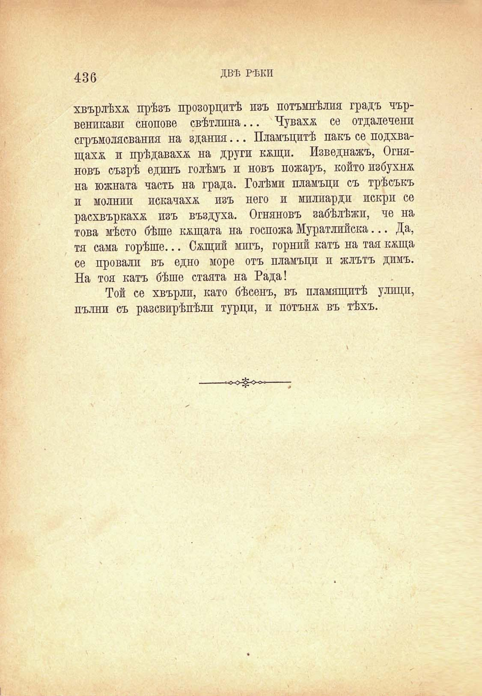

436

ДВѢ РѢКИ

хвърлѣха прѣзъ прозорцитѣ изъ потъмнѣлия градъ чървенлЕави снопове свѣтлина... Чувахѫ се отдалечени сгръмолясвания на здания... Пламъцитѣ пакъ се подхващаха и прѣдаваха на други кжщп. Изведнажъ, Огняновъ съзрѣ единъ голѣмъ и новъ пожаръ, който избухна на южната часть на града. Голѣми пламъци съ трѣсъкъ и молнпи искачахѫ изъ него и милиарди искри се расхвъркахѫ изъ въздуха. Огняновъ забѣлѣжи, че на това мѣсто бѣше кжщата на госпожа Муратлийска... Да, тя сама горѣше... Смций мигъ, горний катъ на тая кжща се провали въ едно море отъ пламъци и жлътъ димъ. На тоя катъ бѣше стаята на Рада!

Той се хвърлп, като бѣсенъ, въ пламящитѣ улици, пълни съ разсвирѣпѣли турци, и потъна въ тѣхъ.

