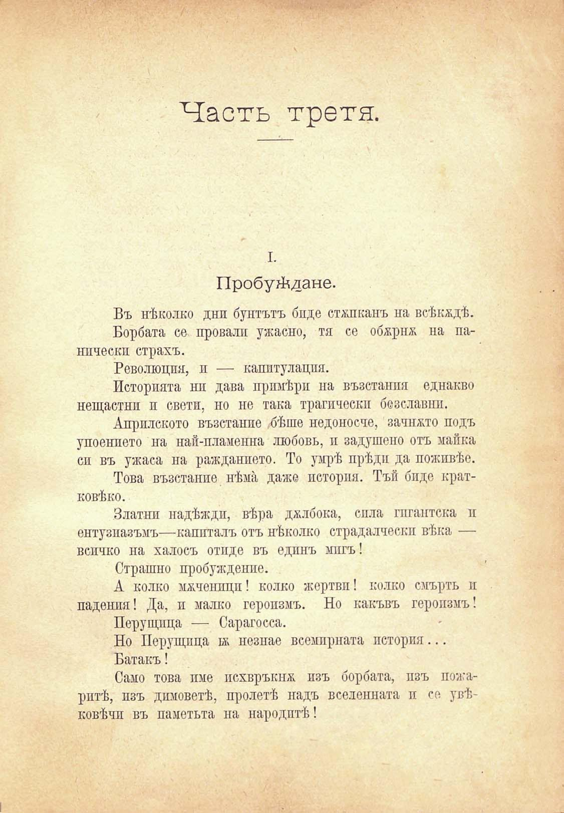

Часть трети.

I.

Пробуждане.

Въ нѣколко дни бунтътъ бнде стѫпканъ на всѣкѫдѣ.

Борбата се провали ужасно, тя се обжрнж на панически страхъ.

Революция, и — капитулация.

Историята ни дава примѣри на възстаипя еднакво нещастни и свети, но не така трагически безславни.

Априлското възстание бѣше недоносче, зачпжто подъ упоението на най-пламенна любовь, и задушено отъ майка си въ ужаса на ражданието. То умрѣ прѣди да поживѣе.

Това възстание нѣма даже история. Тъй биде кратковѣко.

Златни надѣждп, вѣра дълбока, сила гигантска и ентузиазъмъ—капиталъ отъ нѣколко страдалчески вѣка — всичко на халосъ отиде въ едпнъ мигъ!

Страшно пробуждение.

А колко ммченпцп! колко жертвп! колко смърть и падения! Да, и малко геропзмъ. Но какъвъ героизмъ!

Перущица — Сарагосса.

Но Перущица в незпае всемирната история...

Батакъ!

Само това пме псхвръкнж. изъ борбата, изъ пожаритѣ, изъ димоветѣ, пролетѣ надъ вселенната и се увѣковѣчи въ паметьта па народитѣ!

