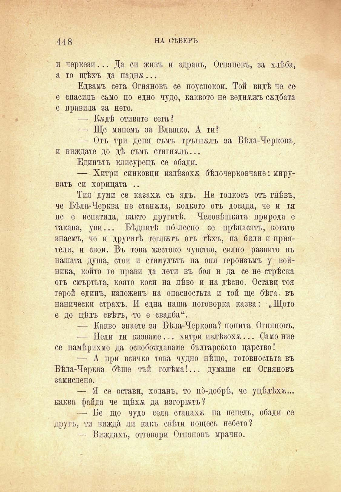



448

НА СѢВЕРЪ

и черкези... Да си живъ и здравъ, Огняновъ, за хлѣба, а то щѣхъ да паднж...

Едвамъ сега Огняновъ се поуспокои. Той видѣ че се е спасилъ само по едно чудо, каквото не веднажъ сѫдбата е правила за него.

— Кждѣ отивате сега?

— Ще минемъ за Влашко. А ти?

— Отъ три деня съмъ тръгнжлъ за Бѣла-Черкова, и виждате до дѣ съмъ стигнжлъ...

Единътъ клисурецъ се обади.

— Хитри синковци излѣзохѫ бѣлочерковчане: мируватъ си хорицата ..

Тия думи се казаха съ ядъ. Не толкосъ отъ гнѣвъ, че Бѣла-Черква не станжла, колкото отъ досада, че и тя не е испатила, както другитѣ. Человѣшката природа е такава, уви... Бѣднитѣ по́-лесно се прѣнасятъ, когато знаемъ, че и другитѣ теглятъ отъ тѣхъ, па били и приятели, и свои. Въ това жестоко чувство, силно развито въ нашата душа, стои и стимулътъ на оня героизъмъ у войника, който го прави да лети въ боя и да се не стрѣска отъ смъртьта, която коси на лѣво и на дѣсно. Остави тоя герой единъ, изложенъ на опасностьта и той ще бѣга, въ панически страхъ. И една наша поговорка казва: „Щото е до цѣлъ свѣтъ, то е свадба“.

— Какво знаете за Бѣла-Черкова? попита Огняновъ.

— Нели ти казваме... хитри излѣзохѫ... Само ние се намѣрихме да освобождаваме българското царство!

— А при всичко това чудно нѣщо, готовностьта въ Бѣла-Черква бѣше тъй голѣма!... думаше си Огняновъ замислено.

— Я се остави, холанъ, то по́-добрѣ, че уцѣлѣхѫ... каква файда че щѣхѫ да изгорятъ?

— Бе що чудо села станахѫ па пепель, обади се другъ, ти вижда, ли какъ свѣти нощесъ небето?

— Виждахъ, отговори Огняновъ мрачно.

