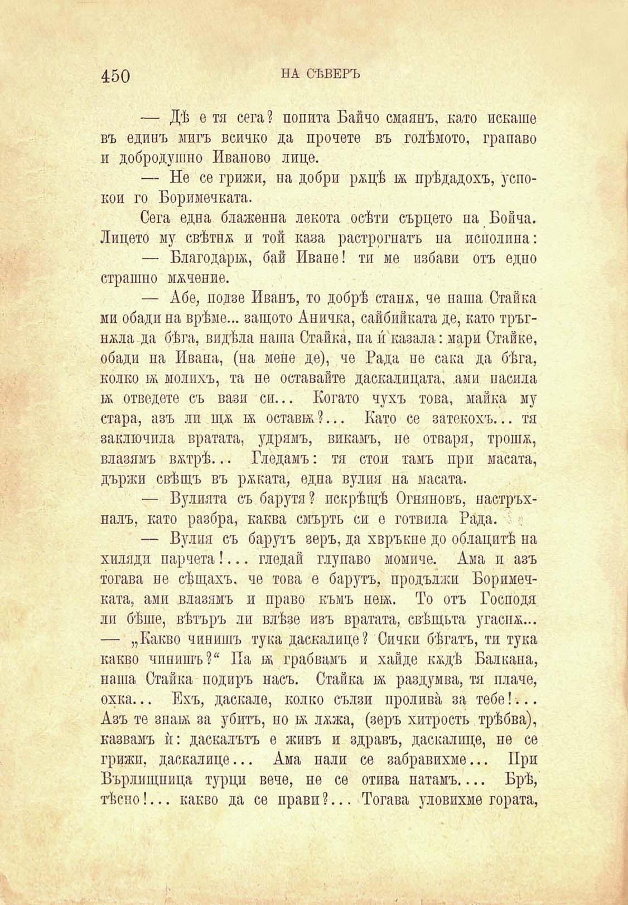

450

НА СѢВЕРЪ

— ДѢ е тя сега? попита Байчо смаянъ, като искаше въ единъ мигъ всичко да прочете въ голѣмото, грапаво и добродушно Иваново лице.

— Не се грижи, на добри ряцѣ бк прѣдадохъ, успокои го Боримечката.

Сега една блаженна лекота осѣти сърцето на Бойча. Лицето му свѣтня и той каза растрогнатъ па исполппа:

— Благодари, бай Иване! ти ме избави отъ едно страшно мячение.

— Абе, подзе Иванъ, то добрѣ стапя, че паша Стайка ми обади иа врѣме... защото Аничка, сайбийката де, като тръгняла да бѣга, видѣла паша Стайка, па и́ казала: мари Ставке, обади па Ивана, (на мене де), че Рада пе сака да бѣга, колко 1я молихъ, та не оставайте даскалицата, ами насила 1Я отведете съ вази си... Когато чухъ това, майка му стара, азъ ли щя бк оставж ?... Като се затекохъ... тя заключила вратата, удрямъ, викамъ, не отваря, трошя, влазямъ вятрѣ... Гледамъ: тя стои тамъ при масата, държи свѣщъ въ ряката, една вулия на масата.

— Вулията съ барути? нскрѣщѣ Огняновъ, настръхпалъ, като разбра, каква смърть си е готвила Рада. :

— Вулия съ барутъ зеръ, да хвръкне до облацитѣ па хиляди парчета!... гледай глупаво момиче. Ама и азъ тогава пе вѣщахъ, че това е барутъ, продължи Боримечката, ами влазямъ и право къмъ неж. То отъ Господи лп бѣше, вѣтъръ ли влѣзе изъ вратата, свѣщьта угаспя... — „Какво чинишъ тука даскалице? Сички бѣгатъ, ти тука какво чинишъ?“ Па бк грабвамъ и хайде кядѣ Балкана, наша Стайка подиръ насъ. Стайка 1я раздумва, тя плаче, охка... Ехъ, даскале, колко сълзи пролива за тебе!... Азъ те знакъ за убитъ, по 1я ляжа, (зеръ хитрость трѣбва), казвамъ ѝ: даскалътъ е живъ и здравъ, даскалице, не се грижи, даскалице... Ама нали се забравихме... При Бърлищпица турци вече, не се отива натамъ.... Брѣ, тѣспо!... какво да се прави ?... Тогава уловихме гората,

