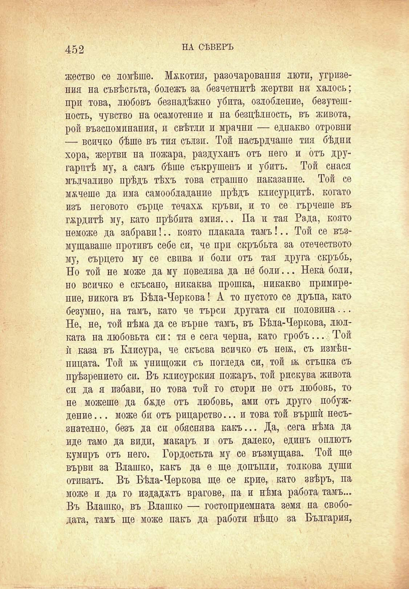

452

НА СѢВЕРЪ

жество се ломѣше. Мжкотия, разочарования люти, угризения на съвѣстьта, бодежъ за безчетнитѣ жертви на халосъ; при това, Любовъ безнадѣжно убита, озлобление, безутешность, чувство на осамотение и на безцѣлность, въ живота, рой възспоминапия, и свѣтли и мрачни — еднакво отровни — всичко бѣше въ тия сълзи. Той насърдчаше тия бѣдни хора, жертви на пожара, раздуханъ отъ него и отъ другаритѣ му, а самъ бѣше съкрушенъ и убитъ. Той снася мълчаливо прѣдъ тѣхъ това страшно наказание. Той се мжчеше да има самообладание прѣдъ клисурцитѣ. когато изъ неговото сърце течахѫ кръви, и то се гърчеше въ гжрдитѣ му, като прѣбита змия... Па и тая Рада, която неможе да забрави!.. която плакала тамъ!.. Той се възмущаваше противъ себе си, че при скръбьта за отечеството му, сърцето му се свива и боли отъ тая друга скръбь, Но той не може да му повелява да не́ боли... Нека боли, но всичко е скъсано, никаква прошка, никакво примирение, никога въ Бѣла-Черкова! А то пустото се дръпа, като безумно, на тамъ, като че търси другата си половина... Не, не, той нѣма да се върне тамъ, въ Бѣла-Черкова, люлката на любовьта си: тя е сега черна, като гробъ... Той ѝ каза въ Клисура, че скъсва всичко съ нетж, съ измѣнницата. Той бь унищожи съ погледа си, той бк стъпка съ прѣзрението си. Въ клисурския пожаръ, той рискува живота си да я избави, но това той го стори не отъ любовь, то не можеше да бѫде отъ любовь, ами отъ друго побуждение... може би отъ рицарство... и това той вършѝ несъзнателно, безъ да си обяснява какъ... Да, сега нѣма да иде тамо да види, макаръ и отъ далеко, единъ оплютъ кумиръ отъ него. Гордостьта му се възмущава. Той ще върви за Влашко, какъ да е ще допъпли, толкова души отиватъ. Въ Бѣла-Черкова ще се крие, като звѣръ, па може и да го издаджтъ врагове, па и нѣма работа тамъ... Въ Влашко, въ Влашко — гостоприемната земя на свободата, тамъ ще може пакъ да работи нѣщо за България,

