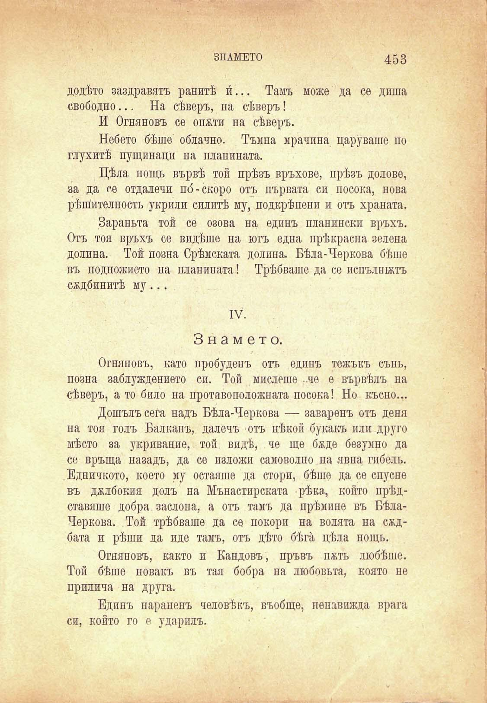

знамето	453

додѣто заздравятъ ранитѣ и́... Тамъ може да се диша свободно... На сѣверъ, на сѣверъ!

И Огняновъ се опжти на сѣверъ.

Небето бѣше облачно. Тъмна мрачина царуваше по глухитѣ пущинаци на планината.

Цѣла нощь вървѣ той прѣзъ връхове, прѣзъ долове, за да се отдалечи по́-скоро отъ първата си посока, нова рѣшителность укрили силитѣ му, подкрѣпени и отъ храната.

Зараньта той се озова на единъ планински връхъ. Отъ тоя връхъ се видѣше на югъ една прѣкрасна зелена долина. Той позна Срѣмската долина. Бѣла-Черкова бѣше въ подножието на планината! Трѣбваше да се испълшжтъ сѫдбинитѣ му ...

IV.

Знамето.

Огняновъ, като пробуденъ отъ единъ тежъкъ сънь, позна заблуждението си. Той мислеше .че е вървѣлъ па сѣверъ, а то било на противоположната посока! Но късно...

Дошълъ сега надъ Бѣла-Черкова — заваренъ отъ деня на тоя голъ Балканъ, далечъ отъ нѣкой букакъ пли друго мѣсто за укривание, той видѣ, че ще бѫде безумно да се връща назадъ, да се изложи самоволно па явна гибель. Едничкото, което му остаяше да стори, бѣше да се спусне въ джлбокия долъ на Манастирската рѣка, който прѣдставяше добра заслона, а отъ тамъ да прѣмине въ БѣлаЧеркова. Той трѣбваше да се покори па волята на сждбата и рѣши да иде тамъ, отъ дѣто бѣга цѣла нощь.

Огпяповъ, както и Кандовъ, пръвъ пжть любѣше. Той бѣше новакъ въ тая бобра на любовьта, която не прилича на друга.

Единъ парапепъ человѣкъ, въобще, ненавижда врага си, който го е ударилъ.

