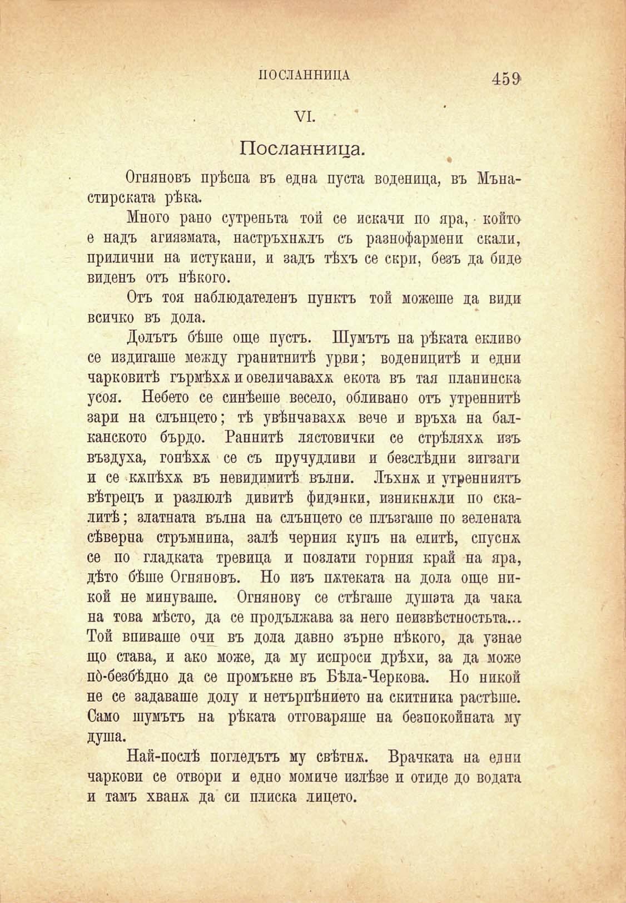

ИОСЛАННИЦА

45$

VI.

Посданница.

Огняновъ прѣспа въ една пуста воденица, въ Мънастирската рѣка.

Много рано сутрепьта той се искани по яра, конто е надъ агиязмата, настръхналъ съ разнофармени скали, прилични на истукани, и задъ тѣхъ се скри, безъ да биде виденъ отъ нѣкого.

Отъ тоя наблюдателенъ пунктъ той можеше да види всичко въ дола.

Долътъ бѣше още пустъ. Шумътъ па рѣката екливо се издигаше между гранитнитѣ урви; воденицитѣ и едни парковитѣ гърмѣха и овеличаваха екота въ тая планинска усоя. Небето се синѣеше весело, обливано отъ утреннитѣ зари на слънцето; тѣ увѣнчавахѫ вече и връха на балканското бърдо. Раннитѣ лястовички се стрѣляхд изъ въздуха, гонѣха се съ пручудливи и безслѣдни зигзаги и се кжпѣхх въ невидимитѣ вълни. Лъхнж. и утринниятъ вѣтрецъ и разлюлѣ дивитѣ фиданки, изникнжли по скалитѣ ; златната вълна на слънцето се плъзгаше по зелената сѣверна стръмнина, залѣ черния купъ на елитѣ, спусна се по гладката тревица и позлати горния край на яра, дѣто бѣше Огняновъ. Но изъ пѫтеката на дола още никой не минуваше. Огнянову се стѣгаше душата да чака на това мѣсто, да се продължава за него неизвѣстностьта... Той впиваше очи въ дола давно зърне нѣкого, да узнае що става, и ако може, да му испроси дрѣхи, за да може пй-безбѣдно да се промъкне въ Бѣла-Черкова. Но никой не се задаваше долу и нетърпѣнието на скитника растѣше. Само шумътъ на рѣката отговаряше на безпокойната му душа.

Най-послѣ погледътъ му свѣтнж. Врачката на едни паркови се отвори и едно момино излѣзе и отиде до водата и тамъ хванж да си плиска лицето.

