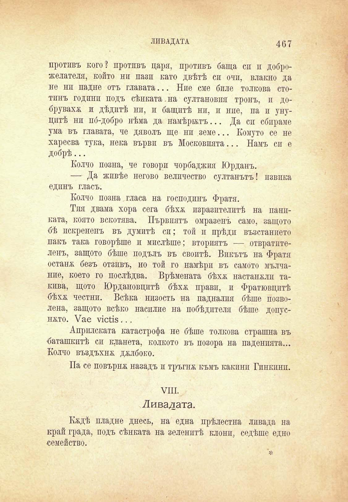

ЛИВАДАТА

467

противъ кого? противъ царя, противъ баща си и доброжелателя, който ни пази като двѣтѣ си очи, влакно да не ни падне отъ главата... Ние сме биле толкова стотпнъ години подъ сѣнката. на султановия тронъ, и добрувахѫ и дѣдитѣ нп, и бащитѣ нп, и ние, па и унуцптѣ ни по́-добро нѣма да намѣрятъ... Да си сбираме ума въ главата, че дяволъ ще ни земе... Комуто се не харесва тука, нека върви въ Московпята... Намъ си е добрѣ...

Колчо позна, че говорп чорбаджия Юрданъ.

— Да живѣе негово величество султанътъ! извика едпнъ гласъ.

Колчо позна гласа на господинъ Фратя.

Тия двама хора сега бѣхѫ изразителитѣ на паииката, която вскотява. Първпятъ омразенъ само, защото бѣ пскренепъ въ думитѣ сп; той и прѣди възванието пакъ така говорѣше и мислѣше; вториятъ — отвратителенъ, защото бѣше подълъ въ своитѣ. Викътъ иа Фратя останж безъ отзивъ, но той го намѣри въ самото мълчание, което го послѣдва. Врѣмената бѣхѫ настанжли такива, щото Юрдановцптѣ бѣхѫ прави, и Фратювцптѣ бѣхѫ честни. Всѣка низость на падналпя бѣше позволена, защото всѣко насилие на побѣдптеля бѣше допуснжто. Уае ухсНз ...

Априлската катастрофа не бѣше толкова страшна въ баташкитѣ си кланета, колкото въ позора на паденията... Колчо въздъхнж джлбоко.

Па се повърнж назадъ и тръгнж къмъ какини Гпнкиип.

VIII.

Ливадата.

Кждѣ пладне днесъ, на една прѣлестна ливада на край града, подъ сѣнката на зеленитѣ клони, седѣше едно семейство.

