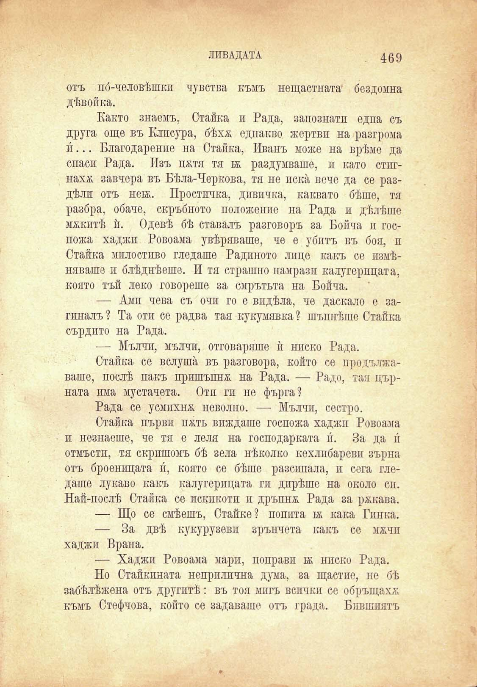

ЛИВАДАТА

469

отъ по́-человѣшки чувства къмъ нещастната бездомна дѣвойка.

Както знаемъ, Стайка и Рада, запознатп една съ друга още въ Клисура, бѣхѫ. еднакво жертви на разгрома и́... Благодарение на Стайка, Иванъ може на врѣме да спаси Рада. Изъ пжтя тя тж раздумваше, и като стпгнахѫ завчера въ Бѣла-Черкова, тя не иска вече да се раздѣли отъ нетж. Простичка, дивичка, каквато бѣше, тя разбра, обаче, скръбното положение на Рада и дѣлѣше мжкптѣ ѝ. Одевѣ бѣ ставалъ разговоръ за Бойча и госпожа хаджи Ровоама увѣряваше, че е убитъ въ боя, и Стайка милостиво гледаше Радииото лице какъ се измѣняваше и блѣднѣеше. И тя страшно намрази калугерицата, която тъй леко говореше за смрътьта на Бойча.

— Ами чева съ очи го е видѣла, че даскало е загиналъ? Та отп се радва тая кукумявка? шъпнѣше Стайка сърдито на Рада.

— Мълчи, мълчи, отговаряше ѝ ниско Рада.

Стайка се вслуша въ разговора, който се продължаваше, послѣ пакъ пришъпнж на Рада. — Радо, тая църната има мустачета. Отп гп не фърга?

Рада се усмихнж неволно. — Мълчи, сестро.

Стайка първи пжть виждаше госпожа хаджи Ровоама п познаеше, че тя е леля иа господарката и́. За да и́ отмъсти, тя скришомъ бѣ зела нѣколко кехлибареви зърна отъ броеницата и́, която се бѣше разсипала, и сега гледаше лукаво какъ калугерицата ги дирѣше иа около сп. Най-послѣ Стайка се пскпкоти и дръпнж Рада за ржкава.

— Що се смѣешъ, Стайке? попита тж кака Гинка.

— За двѣ кукурузевп зрънчета какъ се мжчи хаджи Врана.

— Хаджи Ровоама мари, поправи тж ниско Рада.

Но Стайкината неприлична дума, за щастие, не бѣ забѣлѣжена отъ другитѣ: въ тоя мигъ всички се обръщахѫ къмъ Стефчова, който се задаваше отъ града. Бившиятъ

