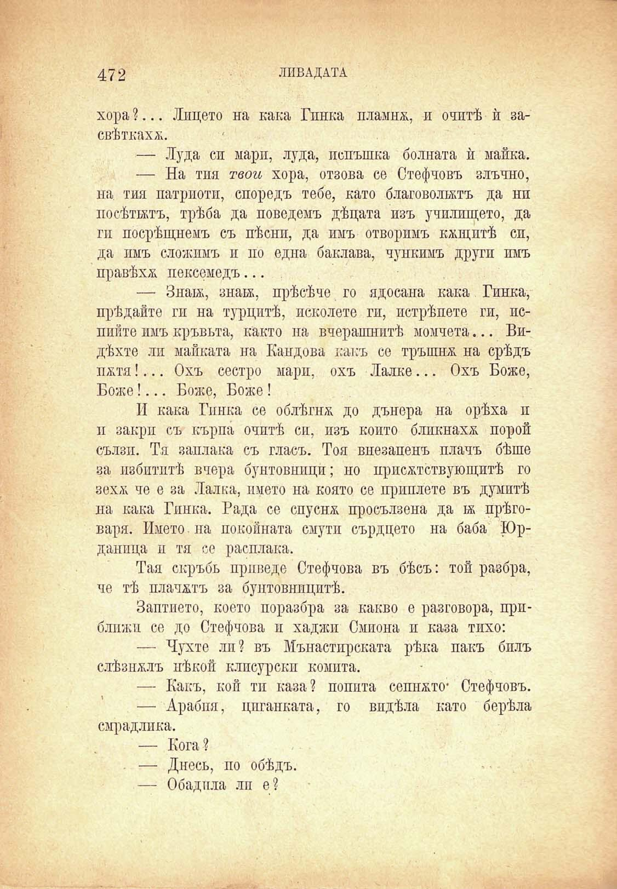

472

ЛИВАДАТА

хора ?... Лицето на кака Гинка пламна, и очитѣ ѝ засвѣткахѫ.

— Луда си мари, луда, пспъшка болната ѝ майка.

— На тия твои хора, отзова се Стефчовъ злъчно, на тия патриоти, споредъ тебе, като благоволятъ да нп посѣтятъ, трѣба да поведемъ дѣцата изъ училището, да ги посрѣщнемъ съ пѣсни, да имъ отворимъ кѫщитѣ сп, да имъ сложимъ и по една баклава, чункимъ други пмъ правѣха пексемедъ...

— Зная, зная, прѣсѣче го ядосана кака Гинка, прѣдайте ги на турцитѣ, исколете ги, пстрѣпете ги, ислийте имъ кръвьта, както на вчерашнитѣ момчета... Видѣхте ли майката на Кандова какъ со тръпшж на срѣдъ пжтя !... Охъ сестро мари, охъ Лалке... Охъ Боже, Боже!... Боже, Боже !

II кака Гинка се облѣгнж до дънера на орѣха п и закри съ кърпа очитѣ сп, изъ който бликнаха порой сълзи. Тя заплака съ гласъ. Тоя внезапенъ плачъ бѣше за избптитѣ вчера бунтовници; но ирисжтствующитѣ го зехѫ че е за Лалка, името на която се приплете въ думитѣ на кака Гинка. Рада се спуснж просълзена да я прѣговаря. Името па покойната смути сърдцето на баба Юрданпца и тя се расплака.

Тая скръбь приведе Стефчова въ бѣсъ: той разбра, че тѣ плачжтъ за бунтовницитѣ.

Заптието, което поразбра за какво е разговора, приблпжп се до Стефчова и хаджи Смиона и каза тихо:

— Чухте лп? въ Манастирската рѣка пакъ билъ слѣзпжлъ нѣкой клисурски комита.

— Какъ, кои ти каза? попита сепижто* Стефчовъ.

— Арабия, циганката, го видѣла като берѣла смрадлика.

— Кога ?

— Днесъ, по обѣдъ.

— Обадпла ли е?

