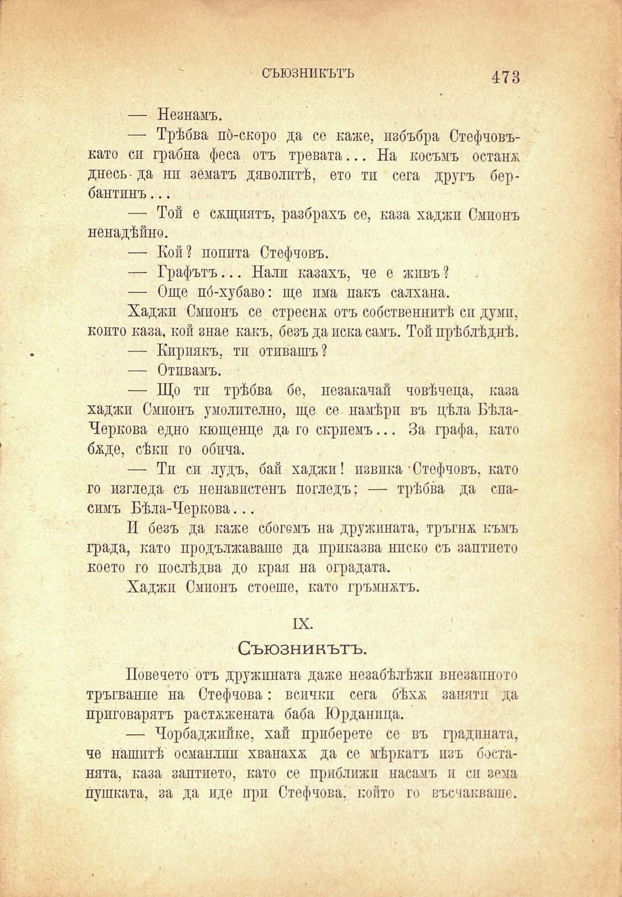

съюзникътъ

473

— Незнамъ.

— Трѣбва по́-скоро да со каже, избъбра Стефчовъкато си грабна феса отъ тревата... На косъмъ остана днесъ- да ни зематъ дяволитѣ, ето тп сега другъ бербантинъ...

— Той е сѫщиятъ, разбрахъ се, каза хаджи Смпонъ ненадѣйно.

— Кой? попита Стефчовъ.

— Графътъ... Нали казахъ, че е жпвъ ?

— Още по́-хубаво: ще има пакъ салхана.

Хаджи Смионъ се стреснж отъ собствениитѣ си думи, конто каза, кой знае какъ, безъ да иска самъ. Тойпрѣблѣднѣ.

— Кириякъ, тп отивашъ?

— Отивамъ.

— Що тп трѣбва бе, позакачай човѣчеца, каза хаджи Смпонъ умолително, ще се намѣри въ цѣла БѣлаЧеркова едно кющенце да го скриемъ... За графа, като бѫде, сѣкп го обича.

— Ти си лудъ, бай хаджи! извика-Стефчовъ, като го изгледа съ ненавистенъ погледъ; — трѣбва да спасимъ Бѣла-Черкова...

И безъ да каже сбогомъ на дружината, тръгиж къмъ града, като продължаваше да приказва ниско съ заптието което го послѣдва до края иа оградата.

Хаджи Смионъ стоеше, като гръмнатъ.

IX.

Съюзникътъ.

Повечето отъ дружината даже незабѣлѣжп внезапното тръгвайте на Стефчова: всички сега бѣхл; запятп да приговарятъ разтѫжената баба Юрданица.

— Чорбаджийке, хай приберете се въ градината, че нашитѣ османлии хванаха да се мѣркатъ изъ бостанята, каза заптието, като се приближи насамъ и си зема пушката, за да иде при Стефчова, който гп въсчаквашс.

