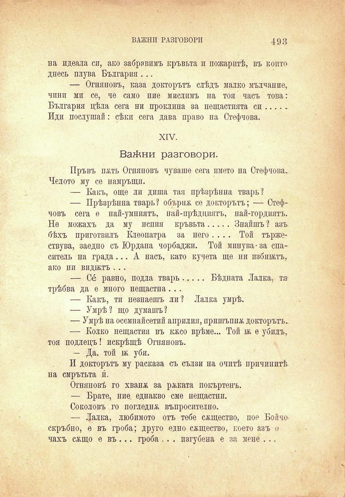

ВАЖНИ РАЗГОВОРИ

493

на идеала си, ако забравимъ кръвьта и пожаритѣ, въ който днесъ плува България ...

— Огняновъ, каза докторътъ слѣдъ малко мълчание, чини ми се, че само ние мислимъ на тоя часъ това: България цѣла сега ни проклина за нещастията си........ Иди послушай: сѣки сега дава право на Стефчова.

XIV.

Важни разговори.

Пръвъ пжть Огняновъ чуваше сега името на Стефчова. Челото му се намръщи.

— Какъ, още ли диша тая прѣзрѣнна тварь?

— Прѣзрѣнна тварь? обърнж се докторътъ; — Стефчовъ сега е най-умниятъ, най-прѣдцнятъ, най-гордиятъ. Не можахъ да му испия кръвьта.............Знайшъ ? азъ бѣхъ приготвилъ Клеопатра за него .... Той тържествува, заедно съ Юрдана чорбаджи. Той минува-за спаситель на града... А насъ, като кучета ще ни избитжтъ, ако ни видътъ . ..

— Се́ равно, подла тварь............ Бѣдната Лалка, тя трѣбва да е много нещастна. ..

— Какъ, ти незнаещъ ли? Лалка умрѣ.

— Умрѣ? що думашъ?

— Умрѣ на осемнайсетий априлия, пришъпнж докторътъ.

— Колко нещастия въ кжсо врѣме... Той ж е убилъ, тоя подлецъ! искрѣщѣ Огняновъ.

— Да. той 1ж уби.

И докторътъ му расказа съ сълзи на очитѣ причинитѣ на смрътьта и́.

Огняновѣ го хванж за ржката покъртенъ.

— Брате, ние. еднакво сме нещастни.

Соколовъ го погледнж въпросително.

— Лалка, любимото отъ тебе сжщество, пор Бойчо скръбно, е въ гроба; друго едно сжщество, което азъ о чахъ сжщо е въ ... гроба . . . изгубена е за мене . ..

